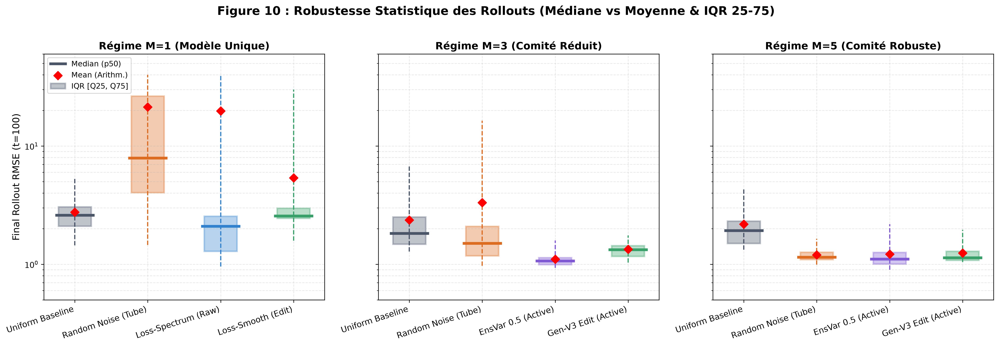
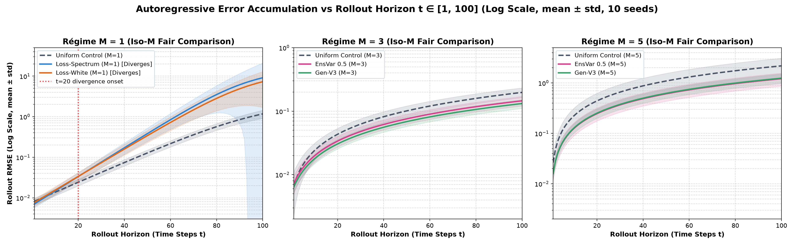

# Rapport Exhaustif de Synthèse Multi-Dimensionnelle & Statistique Robuste

Ce rapport consolide l'ensemble des résultats de la campagne d'apprentissage actif pour les régimes $M=1$, $M=3$ et $M=5$.

> [!IMPORTANT]
> **Méthodologie Statistique Exhaustive :**
> Pour chaque métrique, nous rapportons la distribution complète à travers les 10 graines indépendantes :
> - **Moyenne $\pm$ Écart-type (Std)**
> - **Médiane (p50)** et **Intervalle Interquartile IQR [p25, p75]**
> - **Quantiles de queue : p90, p95, p99**
> - **Extrêmes : Min (Meilleur run) et Max (Pire run / Dérive)**

---

## 1. Visualisations Synthétiques & Trade-offs

---

## 2. Tableaux Statistiques Exhaustifs par Régime d'Ensemble (Round 9 / Final)

# ==========================================================================
# RÉGIME M=1 (Taille du Comité = 1)
# ==========================================================================

### 1. Attracteur In-Distribution (1-pas)

#### Attracteur - RMSE Mean (RMSE)

| Variante | Graines | Moyenne ± Std | **Médiane (p50)** | **IQR [Q25, Q75]** | p90 | p95 | p99 | Min | Max |
|:---|:---:|:---:|:---:|:---:|:---:|:---:|:---:|:---:|:---:|
| **ens1_classic_al_sbal** | 10/10 | 0.0062 ± 0.0023 | **0.0054** | [0.0046, 0.0060] | 0.0092 | 0.011 | 0.012 | 0.0044 | 0.012 |
| **ens1_classic_al_topk** | 10/10 | 0.014 ± 0.015 | **0.0063** | [0.0053, 0.010] | 0.042 | 0.043 | 0.044 | 0.0033 | 0.044 |
| **ens1_heuristic_tube** | 10/10 | 0.0089 ± 0.0033 | **0.0072** | [0.0065, 0.010] | 0.015 | 0.015 | 0.015 | 0.0056 | 0.015 |
| **ens1_loss_edit_smooth** | 10/10 | 0.0071 ± 0.0015 | **0.0066** | [0.0065, 0.0079] | 0.0090 | 0.0096 | 0.010 | 0.0052 | 0.010 |
| **ens1_loss_jitter_replay** | 10/10 | 0.0076 ± 0.0031 | **0.0068** | [0.0054, 0.0096] | 0.011 | 0.013 | 0.014 | 0.0035 | 0.014 |
| **ens1_loss_pushforward** | 10/10 | 0.045 ± 0.00020 | **0.045** | [0.045, 0.045] | 0.045 | 0.045 | 0.045 | 0.044 | 0.045 |
| **ens1_loss_sobolev_tv** | 10/10 | 0.0068 ± 0.0030 | **0.0060** | [0.0047, 0.0082] | 0.011 | 0.012 | 0.013 | 0.0036 | 0.014 |
| **ens1_uniform_baseline** | 10/10 | 0.0042 ± 0.0017 | **0.0039** | [0.0025, 0.0061] | 0.0065 | 0.0066 | 0.0066 | 0.0021 | 0.0066 |
| **pure_scratch_loss_spectrum** | 10/10 | 0.0091 ± 0.0038 | **0.010** | [0.0056, 0.012] | 0.013 | 0.014 | 0.014 | 0.0028 | 0.015 |
| **pure_scratch_loss_white** | 10/10 | 0.0084 ± 0.0095 | **0.0050** | [0.0046, 0.0059] | 0.011 | 0.024 | 0.034 | 0.0041 | 0.037 |

#### Attracteur - NRMSE Mean (NRMSE)

| Variante | Graines | Moyenne ± Std | **Médiane (p50)** | **IQR [Q25, Q75]** | p90 | p95 | p99 | Min | Max |
|:---|:---:|:---:|:---:|:---:|:---:|:---:|:---:|:---:|:---:|
| **ens1_classic_al_sbal** | 10/10 | 0.028 ± 0.0091 | **0.024** | [0.023, 0.031] | 0.044 | 0.046 | 0.047 | 0.021 | 0.048 |
| **ens1_classic_al_topk** | 10/10 | 0.047 ± 0.055 | **0.028** | [0.022, 0.032] | 0.071 | 0.140 | 0.195 | 0.017 | 0.209 |
| **ens1_heuristic_tube** | 10/10 | 0.050 ± 0.023 | **0.047** | [0.041, 0.048] | 0.063 | 0.088 | 0.109 | 0.029 | 0.114 |
| **ens1_loss_edit_smooth** | 10/10 | 0.029 ± 0.0099 | **0.026** | [0.022, 0.032] | 0.036 | 0.045 | 0.053 | 0.019 | 0.054 |
| **ens1_loss_jitter_replay** | 10/10 | 0.030 ± 0.015 | **0.024** | [0.018, 0.042] | 0.048 | 0.054 | 0.059 | 0.013 | 0.060 |
| **ens1_loss_pushforward** | 10/10 | 0.064 ± 0.0044 | **0.063** | [0.062, 0.067] | 0.069 | 0.070 | 0.071 | 0.056 | 0.071 |
| **ens1_loss_sobolev_tv** | 10/10 | 0.024 ± 0.0086 | **0.024** | [0.018, 0.024] | 0.038 | 0.038 | 0.039 | 0.0094 | 0.039 |
| **ens1_uniform_baseline** | 10/10 | 0.015 ± 0.0057 | **0.016** | [0.012, 0.020] | 0.022 | 0.022 | 0.022 | 0.0052 | 0.022 |
| **pure_scratch_loss_spectrum** | 10/10 | 0.042 ± 0.025 | **0.045** | [0.016, 0.066] | 0.071 | 0.074 | 0.076 | 0.0080 | 0.076 |
| **pure_scratch_loss_white** | 10/10 | 0.034 ± 0.030 | **0.026** | [0.021, 0.029] | 0.041 | 0.082 | 0.114 | 0.013 | 0.122 |

### 2. Robustesse Tube Hors-Attracteur (rho=0.5)

#### Tube Low-k (rho=0.5) - RMSE (RMSE)

| Variante | Graines | Moyenne ± Std | **Médiane (p50)** | **IQR [Q25, Q75]** | p90 | p95 | p99 | Min | Max |
|:---|:---:|:---:|:---:|:---:|:---:|:---:|:---:|:---:|:---:|
| **ens1_classic_al_sbal** | 10/10 | 0.021 ± 0.0049 | **0.021** | [0.017, 0.024] | 0.025 | 0.028 | 0.031 | 0.013 | 0.031 |
| **ens1_classic_al_topk** | 10/10 | 0.033 ± 0.031 | **0.020** | [0.018, 0.022] | 0.070 | 0.093 | 0.112 | 0.015 | 0.117 |
| **ens1_heuristic_tube** | 10/10 | 0.014 ± 0.0049 | **0.012** | [0.011, 0.015] | 0.023 | 0.024 | 0.024 | 0.0095 | 0.024 |
| **ens1_loss_edit_smooth** | 10/10 | 0.014 ± 0.0015 | **0.013** | [0.013, 0.014] | 0.016 | 0.016 | 0.017 | 0.011 | 0.017 |
| **ens1_loss_jitter_replay** | 10/10 | 0.013 ± 0.0038 | **0.012** | [0.011, 0.015] | 0.018 | 0.020 | 0.021 | 0.0084 | 0.021 |
| **ens1_loss_pushforward** | 10/10 | 0.117 ± 0.00007 | **0.117** | [0.117, 0.117] | 0.117 | 0.117 | 0.117 | 0.117 | 0.117 |
| **ens1_loss_sobolev_tv** | 10/10 | 0.011 ± 0.0033 | **0.011** | [0.010, 0.013] | 0.015 | 0.016 | 0.018 | 0.0062 | 0.018 |
| **ens1_uniform_baseline** | 10/10 | 0.055 ± 0.015 | **0.054** | [0.043, 0.064] | 0.069 | 0.078 | 0.085 | 0.036 | 0.087 |
| **pure_scratch_loss_spectrum** | 10/10 | 0.014 ± 0.0052 | **0.015** | [0.0090, 0.018] | 0.020 | 0.020 | 0.020 | 0.0050 | 0.020 |
| **pure_scratch_loss_white** | 10/10 | 0.016 ± 0.015 | **0.011** | [0.010, 0.012] | 0.017 | 0.038 | 0.056 | 0.0089 | 0.060 |

#### Tube Mid-k (rho=0.5) - RMSE (RMSE)

| Variante | Graines | Moyenne ± Std | **Médiane (p50)** | **IQR [Q25, Q75]** | p90 | p95 | p99 | Min | Max |
|:---|:---:|:---:|:---:|:---:|:---:|:---:|:---:|:---:|:---:|
| **ens1_classic_al_sbal** | 10/10 | 0.374 ± 0.121 | **0.344** | [0.269, 0.461] | 0.501 | 0.559 | 0.606 | 0.224 | 0.617 |
| **ens1_classic_al_topk** | 10/10 | 0.321 ± 0.070 | **0.326** | [0.252, 0.378] | 0.414 | 0.421 | 0.426 | 0.230 | 0.427 |
| **ens1_heuristic_tube** | 10/10 | 0.185 ± 0.044 | **0.182** | [0.164, 0.190] | 0.211 | 0.256 | 0.292 | 0.123 | 0.301 |
| **ens1_loss_edit_smooth** | 10/10 | 0.045 ± 0.011 | **0.042** | [0.038, 0.049] | 0.058 | 0.065 | 0.070 | 0.034 | 0.071 |
| **ens1_loss_jitter_replay** | 10/10 | 0.029 ± 0.0070 | **0.030** | [0.022, 0.036] | 0.036 | 0.038 | 0.039 | 0.020 | 0.039 |
| **ens1_loss_pushforward** | 10/10 | 0.428 ± 0.00002 | **0.428** | [0.428, 0.428] | 0.428 | 0.428 | 0.428 | 0.427 | 0.428 |
| **ens1_loss_sobolev_tv** | 10/10 | 0.025 ± 0.0093 | **0.023** | [0.020, 0.027] | 0.036 | 0.042 | 0.046 | 0.014 | 0.047 |
| **ens1_uniform_baseline** | 10/10 | 0.343 ± 0.072 | **0.322** | [0.284, 0.396] | 0.447 | 0.462 | 0.474 | 0.261 | 0.477 |
| **pure_scratch_loss_spectrum** | 10/10 | 0.030 ± 0.011 | **0.032** | [0.021, 0.039] | 0.041 | 0.043 | 0.045 | 0.014 | 0.045 |
| **pure_scratch_loss_white** | 10/10 | 0.074 ± 0.058 | **0.045** | [0.045, 0.059] | 0.169 | 0.189 | 0.204 | 0.036 | 0.208 |

#### Tube High-k (rho=0.5) - RMSE (RMSE)

| Variante | Graines | Moyenne ± Std | **Médiane (p50)** | **IQR [Q25, Q75]** | p90 | p95 | p99 | Min | Max |
|:---|:---:|:---:|:---:|:---:|:---:|:---:|:---:|:---:|:---:|
| **ens1_classic_al_sbal** | 10/10 | 0.739 ± 0.087 | **0.695** | [0.681, 0.780] | 0.889 | 0.893 | 0.895 | 0.639 | 0.896 |
| **ens1_classic_al_topk** | 10/10 | 0.701 ± 0.043 | **0.695** | [0.676, 0.711] | 0.765 | 0.773 | 0.780 | 0.622 | 0.781 |
| **ens1_heuristic_tube** | 10/10 | 0.754 ± 0.104 | **0.702** | [0.689, 0.762] | 0.887 | 0.951 | 1.002 | 0.669 | 1.015 |
| **ens1_loss_edit_smooth** | 10/10 | 0.375 ± 0.075 | **0.333** | [0.327, 0.381] | 0.512 | 0.521 | 0.529 | 0.321 | 0.531 |
| **ens1_loss_jitter_replay** | 10/10 | 0.244 ± 0.145 | **0.322** | [0.084, 0.324] | 0.343 | 0.425 | 0.490 | 0.065 | 0.507 |
| **ens1_loss_pushforward** | 10/10 | 0.675 ± 0.00001 | **0.675** | [0.675, 0.675] | 0.675 | 0.675 | 0.675 | 0.675 | 0.675 |
| **ens1_loss_sobolev_tv** | 10/10 | 0.204 ± 0.123 | **0.230** | [0.072, 0.318] | 0.330 | 0.333 | 0.334 | 0.046 | 0.335 |
| **ens1_uniform_baseline** | 10/10 | 0.725 ± 0.085 | **0.702** | [0.682, 0.790] | 0.834 | 0.852 | 0.866 | 0.565 | 0.870 |
| **pure_scratch_loss_spectrum** | 10/10 | 0.248 ± 0.154 | **0.319** | [0.084, 0.331] | 0.365 | 0.442 | 0.503 | 0.036 | 0.518 |
| **pure_scratch_loss_white** | 10/10 | 0.603 ± 0.148 | **0.597** | [0.571, 0.676] | 0.737 | 0.791 | 0.834 | 0.240 | 0.844 |

### 3. Robustesse Tube Hors-Attracteur (rho=0.1)

#### Tube Low-k (rho=0.1) - RMSE (RMSE)

| Variante | Graines | Moyenne ± Std | **Médiane (p50)** | **IQR [Q25, Q75]** | p90 | p95 | p99 | Min | Max |
|:---|:---:|:---:|:---:|:---:|:---:|:---:|:---:|:---:|:---:|
| **ens1_classic_al_sbal** | 10/10 | 0.0091 ± 0.0025 | **0.0086** | [0.0072, 0.010] | 0.013 | 0.013 | 0.014 | 0.0060 | 0.014 |
| **ens1_classic_al_topk** | 10/10 | 0.016 ± 0.014 | **0.0082** | [0.0076, 0.012] | 0.043 | 0.044 | 0.046 | 0.0066 | 0.046 |
| **ens1_heuristic_tube** | 10/10 | 0.0092 ± 0.0032 | **0.0076** | [0.0070, 0.011] | 0.015 | 0.015 | 0.015 | 0.0058 | 0.015 |
| **ens1_loss_edit_smooth** | 10/10 | 0.0078 ± 0.0015 | **0.0073** | [0.0070, 0.0084] | 0.0098 | 0.010 | 0.011 | 0.0057 | 0.011 |
| **ens1_loss_jitter_replay** | 10/10 | 0.0084 ± 0.0031 | **0.0074** | [0.0065, 0.010] | 0.012 | 0.014 | 0.015 | 0.0044 | 0.015 |
| **ens1_loss_pushforward** | 10/10 | 0.046 ± 0.00014 | **0.046** | [0.046, 0.046] | 0.046 | 0.046 | 0.046 | 0.046 | 0.046 |
| **ens1_loss_sobolev_tv** | 10/10 | 0.0072 ± 0.0030 | **0.0065** | [0.0052, 0.0087] | 0.011 | 0.012 | 0.014 | 0.0039 | 0.014 |
| **ens1_uniform_baseline** | 10/10 | 0.016 ± 0.0034 | **0.015** | [0.014, 0.018] | 0.019 | 0.021 | 0.023 | 0.011 | 0.023 |
| **pure_scratch_loss_spectrum** | 10/10 | 0.0094 ± 0.0039 | **0.011** | [0.0058, 0.012] | 0.013 | 0.014 | 0.015 | 0.0029 | 0.015 |
| **pure_scratch_loss_white** | 10/10 | 0.0091 ± 0.0097 | **0.0055** | [0.0052, 0.0066] | 0.011 | 0.025 | 0.035 | 0.0049 | 0.038 |

#### Tube Mid-k (rho=0.1) - RMSE (RMSE)

| Variante | Graines | Moyenne ± Std | **Médiane (p50)** | **IQR [Q25, Q75]** | p90 | p95 | p99 | Min | Max |
|:---|:---:|:---:|:---:|:---:|:---:|:---:|:---:|:---:|:---:|
| **ens1_classic_al_sbal** | 10/10 | 0.108 ± 0.040 | **0.097** | [0.089, 0.106] | 0.127 | 0.175 | 0.212 | 0.074 | 0.222 |
| **ens1_classic_al_topk** | 10/10 | 0.100 ± 0.026 | **0.093** | [0.086, 0.101] | 0.133 | 0.149 | 0.161 | 0.076 | 0.165 |
| **ens1_heuristic_tube** | 10/10 | 0.082 ± 0.040 | **0.079** | [0.055, 0.084] | 0.097 | 0.146 | 0.185 | 0.046 | 0.195 |
| **ens1_loss_edit_smooth** | 10/10 | 0.014 ± 0.0027 | **0.013** | [0.012, 0.015] | 0.016 | 0.018 | 0.020 | 0.010 | 0.021 |
| **ens1_loss_jitter_replay** | 10/10 | 0.012 ± 0.0029 | **0.012** | [0.010, 0.014] | 0.016 | 0.017 | 0.018 | 0.0082 | 0.018 |
| **ens1_loss_pushforward** | 10/10 | 0.097 ± 0.00006 | **0.097** | [0.097, 0.097] | 0.097 | 0.097 | 0.097 | 0.097 | 0.097 |
| **ens1_loss_sobolev_tv** | 10/10 | 0.010 ± 0.0034 | **0.010** | [0.0081, 0.011] | 0.014 | 0.015 | 0.017 | 0.0050 | 0.017 |
| **ens1_uniform_baseline** | 10/10 | 0.185 ± 0.092 | **0.169** | [0.099, 0.249] | 0.310 | 0.329 | 0.345 | 0.077 | 0.349 |
| **pure_scratch_loss_spectrum** | 10/10 | 0.012 ± 0.0051 | **0.013** | [0.0080, 0.016] | 0.019 | 0.019 | 0.019 | 0.0041 | 0.019 |
| **pure_scratch_loss_white** | 10/10 | 0.027 ± 0.023 | **0.018** | [0.016, 0.019] | 0.062 | 0.072 | 0.080 | 0.010 | 0.082 |

#### Tube High-k (rho=0.1) - RMSE (RMSE)

| Variante | Graines | Moyenne ± Std | **Médiane (p50)** | **IQR [Q25, Q75]** | p90 | p95 | p99 | Min | Max |
|:---|:---:|:---:|:---:|:---:|:---:|:---:|:---:|:---:|:---:|
| **ens1_classic_al_sbal** | 10/10 | 0.158 ± 0.031 | **0.148** | [0.140, 0.158] | 0.177 | 0.211 | 0.239 | 0.136 | 0.246 |
| **ens1_classic_al_topk** | 10/10 | 0.153 ± 0.019 | **0.145** | [0.143, 0.153] | 0.175 | 0.188 | 0.199 | 0.140 | 0.202 |
| **ens1_heuristic_tube** | 10/10 | 0.160 ± 0.019 | **0.156** | [0.147, 0.167] | 0.175 | 0.193 | 0.207 | 0.144 | 0.211 |
| **ens1_loss_edit_smooth** | 10/10 | 0.076 ± 0.015 | **0.068** | [0.067, 0.076] | 0.103 | 0.105 | 0.106 | 0.066 | 0.107 |
| **ens1_loss_jitter_replay** | 10/10 | 0.062 ± 0.021 | **0.070** | [0.041, 0.073] | 0.076 | 0.090 | 0.101 | 0.038 | 0.104 |
| **ens1_loss_pushforward** | 10/10 | 0.143 ± 0.00004 | **0.143** | [0.143, 0.143] | 0.143 | 0.143 | 0.143 | 0.143 | 0.143 |
| **ens1_loss_sobolev_tv** | 10/10 | 0.041 ± 0.025 | **0.052** | [0.015, 0.065] | 0.066 | 0.066 | 0.066 | 0.0068 | 0.066 |
| **ens1_uniform_baseline** | 10/10 | 0.204 ± 0.117 | **0.155** | [0.136, 0.189] | 0.428 | 0.433 | 0.437 | 0.096 | 0.438 |
| **pure_scratch_loss_spectrum** | 10/10 | 0.049 ± 0.032 | **0.065** | [0.015, 0.068] | 0.072 | 0.090 | 0.103 | 0.0050 | 0.107 |
| **pure_scratch_loss_white** | 10/10 | 0.137 ± 0.041 | **0.131** | [0.120, 0.147] | 0.187 | 0.202 | 0.213 | 0.050 | 0.216 |

### 4. Ensembles Difficiles & Dérives Physiques

#### TV-Hard Chocs - RMSE Mean (RMSE)

| Variante | Graines | Moyenne ± Std | **Médiane (p50)** | **IQR [Q25, Q75]** | p90 | p95 | p99 | Min | Max |
|:---|:---:|:---:|:---:|:---:|:---:|:---:|:---:|:---:|:---:|
| **ens1_classic_al_sbal** | 10/10 | 0.014 ± 0.0048 | **0.012** | [0.011, 0.013] | 0.020 | 0.023 | 0.025 | 0.0088 | 0.025 |
| **ens1_classic_al_topk** | 10/10 | 0.033 ± 0.041 | **0.015** | [0.010, 0.029] | 0.077 | 0.111 | 0.138 | 0.0069 | 0.144 |
| **ens1_heuristic_tube** | 10/10 | 0.022 ± 0.012 | **0.016** | [0.014, 0.029] | 0.040 | 0.043 | 0.045 | 0.010 | 0.045 |
| **ens1_loss_edit_smooth** | 10/10 | 0.016 ± 0.0029 | **0.016** | [0.014, 0.017] | 0.018 | 0.021 | 0.023 | 0.013 | 0.024 |
| **ens1_loss_jitter_replay** | 10/10 | 0.014 ± 0.0037 | **0.015** | [0.013, 0.016] | 0.018 | 0.019 | 0.019 | 0.0068 | 0.019 |
| **ens1_loss_pushforward** | 10/10 | 0.144 ± 0.00003 | **0.144** | [0.144, 0.144] | 0.144 | 0.144 | 0.144 | 0.144 | 0.144 |
| **ens1_loss_sobolev_tv** | 10/10 | 0.012 ± 0.0054 | **0.011** | [0.0081, 0.016] | 0.020 | 0.021 | 0.022 | 0.0050 | 0.022 |
| **ens1_uniform_baseline** | 10/10 | 0.011 ± 0.0058 | **0.0079** | [0.0061, 0.013] | 0.019 | 0.021 | 0.022 | 0.0053 | 0.023 |
| **pure_scratch_loss_spectrum** | 10/10 | 0.014 ± 0.0038 | **0.015** | [0.015, 0.016] | 0.016 | 0.017 | 0.017 | 0.0038 | 0.017 |
| **pure_scratch_loss_white** | 10/10 | 0.014 ± 0.015 | **0.0094** | [0.0089, 0.011] | 0.020 | 0.039 | 0.054 | 0.0063 | 0.058 |

#### Low-Amplitude Calme - RMSE Mean (RMSE)

| Variante | Graines | Moyenne ± Std | **Médiane (p50)** | **IQR [Q25, Q75]** | p90 | p95 | p99 | Min | Max |
|:---|:---:|:---:|:---:|:---:|:---:|:---:|:---:|:---:|:---:|
| **ens1_classic_al_sbal** | 10/10 | 0.0041 ± 0.0014 | **0.0034** | [0.0032, 0.0041] | 0.0068 | 0.0069 | 0.0070 | 0.0031 | 0.0071 |
| **ens1_classic_al_topk** | 10/10 | 0.0064 ± 0.0086 | **0.0037** | [0.0031, 0.0042] | 0.0072 | 0.020 | 0.030 | 0.0025 | 0.032 |
| **ens1_heuristic_tube** | 10/10 | 0.0060 ± 0.0023 | **0.0056** | [0.0047, 0.0061] | 0.0069 | 0.0097 | 0.012 | 0.0040 | 0.012 |
| **ens1_loss_edit_smooth** | 10/10 | 0.0042 ± 0.0016 | **0.0038** | [0.0031, 0.0047] | 0.0053 | 0.0069 | 0.0082 | 0.0028 | 0.0085 |
| **ens1_loss_jitter_replay** | 10/10 | 0.0043 ± 0.0024 | **0.0036** | [0.0023, 0.0061] | 0.0076 | 0.0083 | 0.0089 | 0.0018 | 0.0090 |
| **ens1_loss_pushforward** | 10/10 | 0.0045 ± 0.00080 | **0.0044** | [0.0041, 0.0051] | 0.0054 | 0.0057 | 0.0059 | 0.0031 | 0.0059 |
| **ens1_loss_sobolev_tv** | 10/10 | 0.0032 ± 0.0012 | **0.0032** | [0.0025, 0.0036] | 0.0047 | 0.0051 | 0.0055 | 0.0011 | 0.0056 |
| **ens1_uniform_baseline** | 10/10 | 0.0022 ± 0.00080 | **0.0023** | [0.0019, 0.0028] | 0.0031 | 0.0032 | 0.0033 | 0.00075 | 0.0033 |
| **pure_scratch_loss_spectrum** | 10/10 | 0.0064 ± 0.0041 | **0.0068** | [0.0021, 0.010] | 0.011 | 0.012 | 0.012 | 0.00097 | 0.012 |
| **pure_scratch_loss_white** | 10/10 | 0.0046 ± 0.0040 | **0.0036** | [0.0031, 0.0039] | 0.0052 | 0.011 | 0.015 | 0.0015 | 0.016 |

#### Mixed Diversity Hard - RMSE Mean (RMSE)

| Variante | Graines | Moyenne ± Std | **Médiane (p50)** | **IQR [Q25, Q75]** | p90 | p95 | p99 | Min | Max |
|:---|:---:|:---:|:---:|:---:|:---:|:---:|:---:|:---:|:---:|
| **ens1_classic_al_sbal** | 10/10 | 0.0080 ± 0.0036 | **0.0070** | [0.0059, 0.0078] | 0.012 | 0.015 | 0.017 | 0.0048 | 0.018 |
| **ens1_classic_al_topk** | 10/10 | 0.020 ± 0.023 | **0.0079** | [0.0076, 0.017] | 0.052 | 0.066 | 0.076 | 0.0038 | 0.079 |
| **ens1_heuristic_tube** | 10/10 | 0.012 ± 0.0055 | **0.0094** | [0.0079, 0.016] | 0.019 | 0.021 | 0.023 | 0.0069 | 0.024 |
| **ens1_loss_edit_smooth** | 10/10 | 0.0094 ± 0.0021 | **0.0090** | [0.0077, 0.0099] | 0.013 | 0.013 | 0.013 | 0.0069 | 0.013 |
| **ens1_loss_jitter_replay** | 10/10 | 0.010 ± 0.0039 | **0.0098** | [0.0082, 0.011] | 0.014 | 0.017 | 0.019 | 0.0046 | 0.019 |
| **ens1_loss_pushforward** | 10/10 | 0.079 ± 0.00007 | **0.079** | [0.079, 0.079] | 0.079 | 0.079 | 0.079 | 0.079 | 0.079 |
| **ens1_loss_sobolev_tv** | 10/10 | 0.0088 ± 0.0040 | **0.0076** | [0.0061, 0.010] | 0.015 | 0.016 | 0.017 | 0.0043 | 0.017 |
| **ens1_uniform_baseline** | 10/10 | 0.0058 ± 0.0025 | **0.0052** | [0.0035, 0.0075] | 0.0096 | 0.0098 | 0.0100 | 0.0030 | 0.010 |
| **pure_scratch_loss_spectrum** | 10/10 | 0.011 ± 0.0035 | **0.012** | [0.0081, 0.013] | 0.014 | 0.015 | 0.015 | 0.0040 | 0.015 |
| **pure_scratch_loss_white** | 10/10 | 0.011 ± 0.013 | **0.0065** | [0.0056, 0.0075] | 0.014 | 0.031 | 0.045 | 0.0047 | 0.048 |

### 5. Rollout Autorégressif Long-Horizon (t=100)

#### Rollout 100 pas - Final RMSE (t=100) (Rollout RMSE)

| Variante | Graines | Moyenne ± Std | **Médiane (p50)** | **IQR [Q25, Q75]** | p90 | p95 | p99 | Min | Max |
|:---|:---:|:---:|:---:|:---:|:---:|:---:|:---:|:---:|:---:|
| **ens1_classic_al_sbal** | 10/10 | 10.71 ± 18.04 | **4.895** | [2.932, 6.932] | 14.62 | 39.52 | 59.43 | 1.863 | 64.41 |
| **ens1_classic_al_topk** | 10/10 | 11.93 ± 17.57 | **3.489** | [2.341, 5.988] | 46.80 | 46.97 | 47.10 | 1.372 | 47.13 |
| **ens1_heuristic_tube** | 10/10 | 21.35 ± 27.11 | **7.920** | [4.028, 26.43] | 57.29 | 72.50 | 84.68 | 1.454 | 87.72 |
| **ens1_loss_edit_smooth** | 10/10 | 5.381 ± 8.240 | **2.566** | [2.448, 2.980] | 6.760 | 18.39 | 27.70 | 1.583 | 30.03 |
| **ens1_loss_jitter_replay** | 10/10 | 1.293 ± 0.589 | **1.058** | [0.978, 1.196] | 1.773 | 2.363 | 2.835 | 0.909 | 2.953 |
| **ens1_loss_pushforward** | 10/10 | 1.590 ± 0.021 | **1.585** | [1.578, 1.606] | 1.615 | 1.624 | 1.631 | 1.559 | 1.632 |
| **ens1_loss_sobolev_tv** | 10/10 | 1.374 ± 0.246 | **1.302** | [1.225, 1.493] | 1.761 | 1.791 | 1.816 | 1.059 | 1.822 |
| **ens1_uniform_baseline** | 10/10 | 2.754 ± 1.096 | **2.606** | [2.098, 3.052] | 3.791 | 4.602 | 5.251 | 1.448 | 5.413 |
| **pure_scratch_loss_spectrum** | 10/10 | 19.83 ± 52.87 | **2.095** | [1.285, 2.543] | 23.16 | 100.8 | 162.9 | 0.955 | 178.4 |
| **pure_scratch_loss_white** | 10/10 | 13.54 ± 14.36 | **6.905** | [2.506, 17.48] | 39.80 | 40.05 | 40.25 | 1.203 | 40.30 |

#### Rollout 100 pas - Mean Horizon RMSE (Rollout RMSE)

| Variante | Graines | Moyenne ± Std | **Médiane (p50)** | **IQR [Q25, Q75]** | p90 | p95 | p99 | Min | Max |
|:---|:---:|:---:|:---:|:---:|:---:|:---:|:---:|:---:|:---:|
| **ens1_classic_al_sbal** | 10/10 | 5.552 ± 7.811 | **3.093** | [1.912, 4.309] | 7.957 | 18.30 | 26.58 | 1.352 | 28.65 |
| **ens1_classic_al_topk** | 10/10 | 5.375 ± 6.119 | **2.417** | [1.747, 4.391] | 16.35 | 17.53 | 18.48 | 1.204 | 18.72 |
| **ens1_heuristic_tube** | 10/10 | 7.334 ± 9.217 | **2.965** | [2.368, 6.963] | 17.70 | 24.78 | 30.44 | 1.229 | 31.86 |
| **ens1_loss_edit_smooth** | 10/10 | 2.142 ± 1.729 | **1.581** | [1.464, 1.745] | 2.587 | 4.934 | 6.811 | 1.163 | 7.280 |
| **ens1_loss_jitter_replay** | 10/10 | 1.036 ± 0.177 | **0.966** | [0.931, 1.036] | 1.194 | 1.359 | 1.491 | 0.915 | 1.524 |
| **ens1_loss_pushforward** | 10/10 | 1.509 ± 0.0073 | **1.507** | [1.505, 1.515] | 1.518 | 1.521 | 1.523 | 1.498 | 1.524 |
| **ens1_loss_sobolev_tv** | 10/10 | 1.085 ± 0.105 | **1.047** | [1.015, 1.129] | 1.271 | 1.274 | 1.277 | 0.972 | 1.278 |
| **ens1_uniform_baseline** | 10/10 | 1.830 ± 0.519 | **1.758** | [1.483, 2.134] | 2.298 | 2.644 | 2.921 | 1.181 | 2.990 |
| **pure_scratch_loss_spectrum** | 10/10 | 7.220 ± 17.52 | **1.233** | [1.041, 1.675] | 8.292 | 34.03 | 54.62 | 0.911 | 59.77 |
| **pure_scratch_loss_white** | 10/10 | 6.323 ± 6.075 | **2.850** | [1.914, 9.502] | 16.57 | 17.23 | 17.76 | 1.029 | 17.89 |

#### Rollout 100 pas - Final NRMSE (t=100) (Rollout NRMSE)

| Variante | Graines | Moyenne ± Std | **Médiane (p50)** | **IQR [Q25, Q75]** | p90 | p95 | p99 | Min | Max |
|:---|:---:|:---:|:---:|:---:|:---:|:---:|:---:|:---:|:---:|
| **ens1_classic_al_sbal** | 10/10 | 11.25 ± 18.95 | **5.143** | [3.081, 7.283] | 15.36 | 41.52 | 62.44 | 1.958 | 67.67 |
| **ens1_classic_al_topk** | 10/10 | 12.53 ± 18.46 | **3.666** | [2.459, 6.291] | 49.17 | 49.35 | 49.48 | 1.441 | 49.52 |
| **ens1_heuristic_tube** | 10/10 | 22.43 ± 28.48 | **8.321** | [4.232, 27.77] | 60.19 | 76.18 | 88.97 | 1.528 | 92.16 |
| **ens1_loss_edit_smooth** | 10/10 | 5.653 ± 8.657 | **2.696** | [2.572, 3.130] | 7.102 | 19.33 | 29.10 | 1.663 | 31.55 |
| **ens1_loss_jitter_replay** | 10/10 | 1.358 ± 0.618 | **1.111** | [1.028, 1.256] | 1.863 | 2.483 | 2.979 | 0.955 | 3.103 |
| **ens1_loss_pushforward** | 10/10 | 1.671 ± 0.022 | **1.665** | [1.658, 1.687] | 1.697 | 1.706 | 1.713 | 1.638 | 1.715 |
| **ens1_loss_sobolev_tv** | 10/10 | 1.444 ± 0.259 | **1.368** | [1.287, 1.569] | 1.850 | 1.882 | 1.907 | 1.112 | 1.914 |
| **ens1_uniform_baseline** | 10/10 | 2.893 ± 1.152 | **2.738** | [2.204, 3.206] | 3.983 | 4.835 | 5.517 | 1.521 | 5.687 |
| **pure_scratch_loss_spectrum** | 10/10 | 20.83 ± 55.55 | **2.201** | [1.350, 2.672] | 24.33 | 105.9 | 171.1 | 1.004 | 187.4 |
| **pure_scratch_loss_white** | 10/10 | 14.23 ± 15.08 | **7.254** | [2.632, 18.36] | 41.81 | 42.08 | 42.29 | 1.264 | 42.34 |

# ==========================================================================
# RÉGIME M=3 (Taille du Comité = 3)
# ==========================================================================

### 1. Attracteur In-Distribution (1-pas)

#### Attracteur - RMSE Mean (RMSE)

| Variante | Graines | Moyenne ± Std | **Médiane (p50)** | **IQR [Q25, Q75]** | p90 | p95 | p99 | Min | Max |
|:---|:---:|:---:|:---:|:---:|:---:|:---:|:---:|:---:|:---:|
| **ens3_classic_al_sbal** | 10/10 | 0.0049 ± 0.0012 | **0.0044** | [0.0042, 0.0060] | 0.0067 | 0.0067 | 0.0067 | 0.0030 | 0.0067 |
| **ens3_classic_al_topk** | 10/10 | 0.0045 ± 0.0016 | **0.0037** | [0.0034, 0.0052] | 0.0060 | 0.0072 | 0.0082 | 0.0031 | 0.0085 |
| **ens3_ensvar_0p5** | 10/10 | 0.0058 ± 0.0020 | **0.0055** | [0.0045, 0.0061] | 0.0069 | 0.0090 | 0.011 | 0.0032 | 0.011 |
| **ens3_gen_v3_edit** | 10/10 | 0.0051 ± 0.00091 | **0.0049** | [0.0046, 0.0051] | 0.0068 | 0.0068 | 0.0068 | 0.0039 | 0.0068 |
| **ens3_heuristic_tube** | 10/10 | 0.0062 ± 0.0017 | **0.0058** | [0.0052, 0.0067] | 0.0078 | 0.0092 | 0.010 | 0.0040 | 0.011 |
| **ens3_uniform_baseline** | 10/10 | 0.0047 ± 0.0041 | **0.0035** | [0.0028, 0.0042] | 0.0061 | 0.011 | 0.016 | 0.0021 | 0.017 |
| **pure_scratch_ensvar_white** | 10/10 | 0.0048 ± 0.0030 | **0.0034** | [0.0031, 0.0060] | 0.0076 | 0.010 | 0.012 | 0.0020 | 0.013 |

#### Attracteur - NRMSE Mean (NRMSE)

| Variante | Graines | Moyenne ± Std | **Médiane (p50)** | **IQR [Q25, Q75]** | p90 | p95 | p99 | Min | Max |
|:---|:---:|:---:|:---:|:---:|:---:|:---:|:---:|:---:|:---:|
| **ens3_classic_al_sbal** | 10/10 | 0.022 ± 0.0043 | **0.021** | [0.018, 0.026] | 0.027 | 0.028 | 0.029 | 0.017 | 0.029 |
| **ens3_classic_al_topk** | 10/10 | 0.021 ± 0.0046 | **0.020** | [0.018, 0.025] | 0.027 | 0.029 | 0.030 | 0.015 | 0.030 |
| **ens3_ensvar_0p5** | 10/10 | 0.026 ± 0.013 | **0.021** | [0.018, 0.027] | 0.038 | 0.049 | 0.058 | 0.013 | 0.061 |
| **ens3_gen_v3_edit** | 10/10 | 0.019 ± 0.0038 | **0.018** | [0.017, 0.022] | 0.023 | 0.026 | 0.028 | 0.014 | 0.028 |
| **ens3_heuristic_tube** | 10/10 | 0.034 ± 0.0079 | **0.031** | [0.028, 0.036] | 0.045 | 0.048 | 0.051 | 0.026 | 0.052 |
| **ens3_uniform_baseline** | 10/10 | 0.016 ± 0.0081 | **0.014** | [0.012, 0.017] | 0.020 | 0.029 | 0.037 | 0.0070 | 0.039 |
| **pure_scratch_ensvar_white** | 10/10 | 0.020 ± 0.012 | **0.014** | [0.011, 0.030] | 0.036 | 0.040 | 0.044 | 0.0084 | 0.045 |

### 2. Robustesse Tube Hors-Attracteur (rho=0.5)

#### Tube Low-k (rho=0.5) - RMSE (RMSE)

| Variante | Graines | Moyenne ± Std | **Médiane (p50)** | **IQR [Q25, Q75]** | p90 | p95 | p99 | Min | Max |
|:---|:---:|:---:|:---:|:---:|:---:|:---:|:---:|:---:|:---:|
| **ens3_classic_al_sbal** | 10/10 | 0.015 ± 0.0016 | **0.015** | [0.014, 0.017] | 0.017 | 0.018 | 0.018 | 0.013 | 0.018 |
| **ens3_classic_al_topk** | 10/10 | 0.015 ± 0.0021 | **0.015** | [0.014, 0.017] | 0.018 | 0.018 | 0.018 | 0.011 | 0.018 |
| **ens3_ensvar_0p5** | 10/10 | 0.011 ± 0.0020 | **0.010** | [0.0090, 0.012] | 0.013 | 0.014 | 0.014 | 0.0080 | 0.014 |
| **ens3_gen_v3_edit** | 10/10 | 0.0083 ± 0.0013 | **0.0083** | [0.0073, 0.0091] | 0.0094 | 0.010 | 0.011 | 0.0062 | 0.011 |
| **ens3_heuristic_tube** | 10/10 | 0.011 ± 0.0020 | **0.010** | [0.0089, 0.012] | 0.013 | 0.014 | 0.014 | 0.0082 | 0.015 |
| **ens3_uniform_baseline** | 10/10 | 0.050 ± 0.0086 | **0.052** | [0.046, 0.053] | 0.056 | 0.061 | 0.066 | 0.035 | 0.067 |
| **pure_scratch_ensvar_white** | 10/10 | 0.010 ± 0.0042 | **0.0079** | [0.0076, 0.011] | 0.015 | 0.018 | 0.020 | 0.0067 | 0.020 |

#### Tube Mid-k (rho=0.5) - RMSE (RMSE)

| Variante | Graines | Moyenne ± Std | **Médiane (p50)** | **IQR [Q25, Q75]** | p90 | p95 | p99 | Min | Max |
|:---|:---:|:---:|:---:|:---:|:---:|:---:|:---:|:---:|:---:|
| **ens3_classic_al_sbal** | 10/10 | 0.294 ± 0.083 | **0.264** | [0.225, 0.349] | 0.408 | 0.430 | 0.447 | 0.205 | 0.451 |
| **ens3_classic_al_topk** | 10/10 | 0.242 ± 0.050 | **0.212** | [0.210, 0.274] | 0.295 | 0.327 | 0.353 | 0.195 | 0.359 |
| **ens3_ensvar_0p5** | 10/10 | 0.020 ± 0.0048 | **0.018** | [0.017, 0.022] | 0.023 | 0.028 | 0.031 | 0.014 | 0.032 |
| **ens3_gen_v3_edit** | 10/10 | 0.025 ± 0.0068 | **0.024** | [0.021, 0.026] | 0.031 | 0.037 | 0.041 | 0.017 | 0.043 |
| **ens3_heuristic_tube** | 10/10 | 0.136 ± 0.015 | **0.133** | [0.127, 0.147] | 0.150 | 0.159 | 0.166 | 0.114 | 0.168 |
| **ens3_uniform_baseline** | 10/10 | 0.263 ± 0.038 | **0.252** | [0.229, 0.286] | 0.317 | 0.326 | 0.333 | 0.221 | 0.335 |
| **pure_scratch_ensvar_white** | 10/10 | 0.050 ± 0.028 | **0.038** | [0.028, 0.070] | 0.085 | 0.097 | 0.106 | 0.023 | 0.109 |

#### Tube High-k (rho=0.5) - RMSE (RMSE)

| Variante | Graines | Moyenne ± Std | **Médiane (p50)** | **IQR [Q25, Q75]** | p90 | p95 | p99 | Min | Max |
|:---|:---:|:---:|:---:|:---:|:---:|:---:|:---:|:---:|:---:|
| **ens3_classic_al_sbal** | 10/10 | 0.726 ± 0.074 | **0.701** | [0.677, 0.734] | 0.838 | 0.866 | 0.887 | 0.654 | 0.893 |
| **ens3_classic_al_topk** | 10/10 | 0.679 ± 0.055 | **0.670** | [0.659, 0.715] | 0.742 | 0.757 | 0.769 | 0.564 | 0.772 |
| **ens3_ensvar_0p5** | 10/10 | 0.158 ± 0.049 | **0.136** | [0.122, 0.203] | 0.228 | 0.230 | 0.230 | 0.085 | 0.231 |
| **ens3_gen_v3_edit** | 10/10 | 0.302 ± 0.093 | **0.309** | [0.228, 0.381] | 0.389 | 0.418 | 0.441 | 0.161 | 0.447 |
| **ens3_heuristic_tube** | 10/10 | 0.674 ± 0.030 | **0.678** | [0.664, 0.694] | 0.700 | 0.707 | 0.713 | 0.603 | 0.715 |
| **ens3_uniform_baseline** | 10/10 | 0.685 ± 0.026 | **0.685** | [0.672, 0.696] | 0.716 | 0.723 | 0.729 | 0.630 | 0.730 |
| **pure_scratch_ensvar_white** | 10/10 | 0.435 ± 0.131 | **0.457** | [0.319, 0.533] | 0.587 | 0.612 | 0.632 | 0.231 | 0.637 |

### 3. Robustesse Tube Hors-Attracteur (rho=0.1)

#### Tube Low-k (rho=0.1) - RMSE (RMSE)

| Variante | Graines | Moyenne ± Std | **Médiane (p50)** | **IQR [Q25, Q75]** | p90 | p95 | p99 | Min | Max |
|:---|:---:|:---:|:---:|:---:|:---:|:---:|:---:|:---:|:---:|
| **ens3_classic_al_sbal** | 10/10 | 0.0065 ± 0.0011 | **0.0061** | [0.0057, 0.0076] | 0.0081 | 0.0081 | 0.0082 | 0.0050 | 0.0082 |
| **ens3_classic_al_topk** | 10/10 | 0.0064 ± 0.0013 | **0.0062** | [0.0056, 0.0070] | 0.0074 | 0.0085 | 0.0094 | 0.0047 | 0.0096 |
| **ens3_ensvar_0p5** | 10/10 | 0.0062 ± 0.0019 | **0.0061** | [0.0053, 0.0065] | 0.0073 | 0.0093 | 0.011 | 0.0037 | 0.011 |
| **ens3_gen_v3_edit** | 10/10 | 0.0053 ± 0.00091 | **0.0051** | [0.0047, 0.0054] | 0.0068 | 0.0069 | 0.0070 | 0.0039 | 0.0070 |
| **ens3_heuristic_tube** | 10/10 | 0.0065 ± 0.0018 | **0.0060** | [0.0054, 0.0070] | 0.0081 | 0.0095 | 0.011 | 0.0042 | 0.011 |
| **ens3_uniform_baseline** | 10/10 | 0.014 ± 0.0032 | **0.014** | [0.013, 0.014] | 0.015 | 0.019 | 0.022 | 0.011 | 0.023 |
| **pure_scratch_ensvar_white** | 10/10 | 0.0056 ± 0.0031 | **0.0041** | [0.0037, 0.0069] | 0.0084 | 0.011 | 0.013 | 0.0029 | 0.013 |

#### Tube Mid-k (rho=0.1) - RMSE (RMSE)

| Variante | Graines | Moyenne ± Std | **Médiane (p50)** | **IQR [Q25, Q75]** | p90 | p95 | p99 | Min | Max |
|:---|:---:|:---:|:---:|:---:|:---:|:---:|:---:|:---:|:---:|
| **ens3_classic_al_sbal** | 10/10 | 0.075 ± 0.012 | **0.073** | [0.065, 0.082] | 0.091 | 0.094 | 0.096 | 0.056 | 0.097 |
| **ens3_classic_al_topk** | 10/10 | 0.067 ± 0.0098 | **0.064** | [0.064, 0.071] | 0.074 | 0.083 | 0.091 | 0.054 | 0.093 |
| **ens3_ensvar_0p5** | 10/10 | 0.0081 ± 0.0019 | **0.0075** | [0.0068, 0.0085] | 0.011 | 0.012 | 0.012 | 0.0056 | 0.012 |
| **ens3_gen_v3_edit** | 10/10 | 0.0079 ± 0.0018 | **0.0074** | [0.0070, 0.0081] | 0.0087 | 0.011 | 0.013 | 0.0062 | 0.013 |
| **ens3_heuristic_tube** | 10/10 | 0.052 ± 0.012 | **0.047** | [0.042, 0.058] | 0.069 | 0.074 | 0.078 | 0.040 | 0.079 |
| **ens3_uniform_baseline** | 10/10 | 0.131 ± 0.029 | **0.125** | [0.120, 0.156] | 0.165 | 0.170 | 0.174 | 0.075 | 0.175 |
| **pure_scratch_ensvar_white** | 10/10 | 0.016 ± 0.012 | **0.011** | [0.0081, 0.021] | 0.034 | 0.039 | 0.042 | 0.0065 | 0.043 |

#### Tube High-k (rho=0.1) - RMSE (RMSE)

| Variante | Graines | Moyenne ± Std | **Médiane (p50)** | **IQR [Q25, Q75]** | p90 | p95 | p99 | Min | Max |
|:---|:---:|:---:|:---:|:---:|:---:|:---:|:---:|:---:|:---:|
| **ens3_classic_al_sbal** | 10/10 | 0.152 ± 0.026 | **0.140** | [0.136, 0.153] | 0.195 | 0.202 | 0.207 | 0.129 | 0.208 |
| **ens3_classic_al_topk** | 10/10 | 0.138 ± 0.013 | **0.138** | [0.135, 0.146] | 0.150 | 0.154 | 0.158 | 0.108 | 0.159 |
| **ens3_ensvar_0p5** | 10/10 | 0.030 ± 0.0094 | **0.027** | [0.023, 0.036] | 0.044 | 0.045 | 0.045 | 0.015 | 0.045 |
| **ens3_gen_v3_edit** | 10/10 | 0.061 ± 0.020 | **0.063** | [0.046, 0.078] | 0.081 | 0.086 | 0.090 | 0.030 | 0.091 |
| **ens3_heuristic_tube** | 10/10 | 0.140 ± 0.0073 | **0.141** | [0.137, 0.144] | 0.146 | 0.147 | 0.148 | 0.121 | 0.149 |
| **ens3_uniform_baseline** | 10/10 | 0.158 ± 0.035 | **0.147** | [0.139, 0.155] | 0.206 | 0.225 | 0.241 | 0.119 | 0.245 |
| **pure_scratch_ensvar_white** | 10/10 | 0.087 ± 0.041 | **0.088** | [0.052, 0.115] | 0.131 | 0.145 | 0.157 | 0.029 | 0.160 |

### 4. Ensembles Difficiles & Dérives Physiques

#### TV-Hard Chocs - RMSE Mean (RMSE)

| Variante | Graines | Moyenne ± Std | **Médiane (p50)** | **IQR [Q25, Q75]** | p90 | p95 | p99 | Min | Max |
|:---|:---:|:---:|:---:|:---:|:---:|:---:|:---:|:---:|:---:|
| **ens3_classic_al_sbal** | 10/10 | 0.0096 ± 0.0028 | **0.0085** | [0.0081, 0.011] | 0.014 | 0.014 | 0.015 | 0.0059 | 0.015 |
| **ens3_classic_al_topk** | 10/10 | 0.0084 ± 0.0032 | **0.0075** | [0.0063, 0.0097] | 0.013 | 0.014 | 0.014 | 0.0042 | 0.015 |
| **ens3_ensvar_0p5** | 10/10 | 0.0099 ± 0.0022 | **0.010** | [0.0087, 0.011] | 0.012 | 0.012 | 0.013 | 0.0051 | 0.013 |
| **ens3_gen_v3_edit** | 10/10 | 0.012 ± 0.0039 | **0.0099** | [0.0093, 0.011] | 0.018 | 0.019 | 0.020 | 0.0072 | 0.020 |
| **ens3_heuristic_tube** | 10/10 | 0.014 ± 0.0038 | **0.014** | [0.011, 0.017] | 0.019 | 0.020 | 0.020 | 0.0079 | 0.020 |
| **ens3_uniform_baseline** | 10/10 | 0.013 ± 0.014 | **0.0076** | [0.0070, 0.014] | 0.020 | 0.037 | 0.050 | 0.0043 | 0.053 |
| **pure_scratch_ensvar_white** | 10/10 | 0.0093 ± 0.0053 | **0.0078** | [0.0059, 0.010] | 0.013 | 0.018 | 0.022 | 0.0048 | 0.023 |

#### Low-Amplitude Calme - RMSE Mean (RMSE)

| Variante | Graines | Moyenne ± Std | **Médiane (p50)** | **IQR [Q25, Q75]** | p90 | p95 | p99 | Min | Max |
|:---|:---:|:---:|:---:|:---:|:---:|:---:|:---:|:---:|:---:|
| **ens3_classic_al_sbal** | 10/10 | 0.0032 ± 0.00065 | **0.0031** | [0.0026, 0.0038] | 0.0040 | 0.0041 | 0.0042 | 0.0022 | 0.0042 |
| **ens3_classic_al_topk** | 10/10 | 0.0030 ± 0.00055 | **0.0030** | [0.0027, 0.0034] | 0.0038 | 0.0038 | 0.0038 | 0.0021 | 0.0038 |
| **ens3_ensvar_0p5** | 10/10 | 0.0039 ± 0.0022 | **0.0030** | [0.0024, 0.0043] | 0.0061 | 0.0079 | 0.0093 | 0.0020 | 0.0096 |
| **ens3_gen_v3_edit** | 10/10 | 0.0028 ± 0.00065 | **0.0027** | [0.0023, 0.0032] | 0.0035 | 0.0039 | 0.0042 | 0.0020 | 0.0043 |
| **ens3_heuristic_tube** | 10/10 | 0.0042 ± 0.00094 | **0.0038** | [0.0035, 0.0043] | 0.0056 | 0.0060 | 0.0062 | 0.0034 | 0.0063 |
| **ens3_uniform_baseline** | 10/10 | 0.0022 ± 0.00092 | **0.0020** | [0.0019, 0.0025] | 0.0028 | 0.0037 | 0.0044 | 0.0010 | 0.0046 |
| **pure_scratch_ensvar_white** | 10/10 | 0.0029 ± 0.0017 | **0.0022** | [0.0015, 0.0045] | 0.0053 | 0.0056 | 0.0059 | 0.0012 | 0.0060 |

#### Mixed Diversity Hard - RMSE Mean (RMSE)

| Variante | Graines | Moyenne ± Std | **Médiane (p50)** | **IQR [Q25, Q75]** | p90 | p95 | p99 | Min | Max |
|:---|:---:|:---:|:---:|:---:|:---:|:---:|:---:|:---:|:---:|
| **ens3_classic_al_sbal** | 10/10 | 0.0062 ± 0.0020 | **0.0056** | [0.0052, 0.0073] | 0.0094 | 0.0095 | 0.0097 | 0.0038 | 0.0097 |
| **ens3_classic_al_topk** | 10/10 | 0.0059 ± 0.0023 | **0.0045** | [0.0043, 0.0066] | 0.0094 | 0.010 | 0.011 | 0.0037 | 0.011 |
| **ens3_ensvar_0p5** | 10/10 | 0.0072 ± 0.0022 | **0.0067** | [0.0060, 0.0077] | 0.010 | 0.011 | 0.012 | 0.0040 | 0.012 |
| **ens3_gen_v3_edit** | 10/10 | 0.0065 ± 0.0016 | **0.0065** | [0.0052, 0.0068] | 0.0083 | 0.0092 | 0.0099 | 0.0047 | 0.010 |
| **ens3_heuristic_tube** | 10/10 | 0.0080 ± 0.0027 | **0.0072** | [0.0061, 0.0098] | 0.011 | 0.012 | 0.014 | 0.0045 | 0.014 |
| **ens3_uniform_baseline** | 10/10 | 0.0069 ± 0.0071 | **0.0041** | [0.0037, 0.0068] | 0.0096 | 0.019 | 0.026 | 0.0026 | 0.028 |
| **pure_scratch_ensvar_white** | 10/10 | 0.0059 ± 0.0036 | **0.0049** | [0.0035, 0.0065] | 0.0095 | 0.012 | 0.015 | 0.0024 | 0.015 |

### 5. Rollout Autorégressif Long-Horizon (t=100)

#### Rollout 100 pas - Final RMSE (t=100) (Rollout RMSE)

| Variante | Graines | Moyenne ± Std | **Médiane (p50)** | **IQR [Q25, Q75]** | p90 | p95 | p99 | Min | Max |
|:---|:---:|:---:|:---:|:---:|:---:|:---:|:---:|:---:|:---:|
| **ens3_classic_al_sbal** | 10/10 | 4.664 ± 3.295 | **4.457** | [2.227, 5.070] | 6.836 | 10.15 | 12.80 | 1.505 | 13.46 |
| **ens3_classic_al_topk** | 10/10 | 2.496 ± 1.978 | **1.443** | [1.312, 3.042] | 4.347 | 6.029 | 7.376 | 1.025 | 7.712 |
| **ens3_ensvar_0p5** | 10/10 | 1.105 ± 0.176 | **1.066** | [0.993, 1.135] | 1.203 | 1.396 | 1.550 | 0.934 | 1.589 |
| **ens3_gen_v3_edit** | 10/10 | 1.340 ± 0.215 | **1.330** | [1.164, 1.436] | 1.615 | 1.685 | 1.741 | 1.033 | 1.755 |
| **ens3_heuristic_tube** | 10/10 | 2.286 ± 1.266 | **1.788** | [1.523, 2.692] | 3.417 | 4.512 | 5.388 | 1.238 | 5.606 |
| **ens3_uniform_baseline** | 10/10 | 2.369 ± 1.526 | **1.824** | [1.479, 2.513] | 3.103 | 4.911 | 6.358 | 1.280 | 6.720 |
| **pure_scratch_ensvar_white** | 10/10 | 1.649 ± 1.333 | **1.141** | [1.045, 1.543] | 2.032 | 3.810 | 5.232 | 0.933 | 5.587 |

#### Rollout 100 pas - Mean Horizon RMSE (Rollout RMSE)

| Variante | Graines | Moyenne ± Std | **Médiane (p50)** | **IQR [Q25, Q75]** | p90 | p95 | p99 | Min | Max |
|:---|:---:|:---:|:---:|:---:|:---:|:---:|:---:|:---:|:---:|
| **ens3_classic_al_sbal** | 10/10 | 2.725 ± 1.486 | **2.733** | [1.613, 2.980] | 3.722 | 5.167 | 6.322 | 1.151 | 6.611 |
| **ens3_classic_al_topk** | 10/10 | 1.707 ± 0.888 | **1.173** | [1.061, 2.219] | 2.528 | 3.196 | 3.730 | 0.993 | 3.864 |
| **ens3_ensvar_0p5** | 10/10 | 0.991 ± 0.090 | **0.978** | [0.955, 0.984] | 1.017 | 1.133 | 1.226 | 0.910 | 1.249 |
| **ens3_gen_v3_edit** | 10/10 | 1.147 ± 0.116 | **1.144** | [1.054, 1.245] | 1.282 | 1.307 | 1.328 | 0.945 | 1.333 |
| **ens3_heuristic_tube** | 10/10 | 1.472 ± 0.502 | **1.320** | [1.209, 1.511] | 1.792 | 2.336 | 2.772 | 1.066 | 2.881 |
| **ens3_uniform_baseline** | 10/10 | 1.606 ± 0.581 | **1.408** | [1.270, 1.670] | 1.905 | 2.574 | 3.109 | 1.094 | 3.243 |
| **pure_scratch_ensvar_white** | 10/10 | 1.262 ± 0.638 | **1.025** | [0.980, 1.165] | 1.427 | 2.292 | 2.984 | 0.949 | 3.157 |

#### Rollout 100 pas - Final NRMSE (t=100) (Rollout NRMSE)

| Variante | Graines | Moyenne ± Std | **Médiane (p50)** | **IQR [Q25, Q75]** | p90 | p95 | p99 | Min | Max |
|:---|:---:|:---:|:---:|:---:|:---:|:---:|:---:|:---:|:---:|
| **ens3_classic_al_sbal** | 10/10 | 4.900 ± 3.461 | **4.683** | [2.340, 5.327] | 7.182 | 10.66 | 13.45 | 1.581 | 14.14 |
| **ens3_classic_al_topk** | 10/10 | 2.623 ± 2.078 | **1.516** | [1.379, 3.196] | 4.567 | 6.335 | 7.749 | 1.077 | 8.103 |
| **ens3_ensvar_0p5** | 10/10 | 1.161 ± 0.185 | **1.120** | [1.043, 1.192] | 1.264 | 1.467 | 1.629 | 0.981 | 1.669 |
| **ens3_gen_v3_edit** | 10/10 | 1.408 ± 0.225 | **1.398** | [1.223, 1.509] | 1.697 | 1.770 | 1.829 | 1.086 | 1.844 |
| **ens3_heuristic_tube** | 10/10 | 2.402 ± 1.330 | **1.878** | [1.600, 2.828] | 3.590 | 4.740 | 5.660 | 1.300 | 5.890 |
| **ens3_uniform_baseline** | 10/10 | 2.489 ± 1.604 | **1.917** | [1.554, 2.640] | 3.260 | 5.160 | 6.680 | 1.345 | 7.060 |
| **pure_scratch_ensvar_white** | 10/10 | 1.733 ± 1.400 | **1.198** | [1.098, 1.621] | 2.135 | 4.003 | 5.497 | 0.980 | 5.870 |

# ==========================================================================
# RÉGIME M=5 (Taille du Comité = 5)
# ==========================================================================

### 1. Attracteur In-Distribution (1-pas)

#### Attracteur - RMSE Mean (RMSE)

| Variante | Graines | Moyenne ± Std | **Médiane (p50)** | **IQR [Q25, Q75]** | p90 | p95 | p99 | Min | Max |
|:---|:---:|:---:|:---:|:---:|:---:|:---:|:---:|:---:|:---:|
| **ens5_classic_al_sbal** | 10/10 | 0.0045 ± 0.0023 | **0.0038** | [0.0031, 0.0042] | 0.0078 | 0.0090 | 0.0100 | 0.0026 | 0.010 |
| **ens5_classic_al_topk** | 10/10 | 0.0040 ± 0.0025 | **0.0033** | [0.0027, 0.0035] | 0.0050 | 0.0082 | 0.011 | 0.0024 | 0.011 |
| **ens5_ensvar_0p5** | 10/10 | 0.0049 ± 0.0011 | **0.0047** | [0.0042, 0.0057] | 0.0064 | 0.0067 | 0.0069 | 0.0034 | 0.0070 |
| **ens5_gen_v3_edit** | 10/10 | 0.0095 ± 0.011 | **0.0047** | [0.0043, 0.0063] | 0.021 | 0.030 | 0.037 | 0.0034 | 0.038 |
| **ens5_heuristic_tube** | 10/10 | 0.0052 ± 0.0021 | **0.0047** | [0.0044, 0.0051] | 0.0058 | 0.0085 | 0.011 | 0.0031 | 0.011 |
| **ens5_uniform_baseline** | 10/10 | 0.0045 ± 0.0030 | **0.0031** | [0.0028, 0.0043] | 0.010 | 0.010 | 0.011 | 0.0021 | 0.011 |

#### Attracteur - NRMSE Mean (NRMSE)

| Variante | Graines | Moyenne ± Std | **Médiane (p50)** | **IQR [Q25, Q75]** | p90 | p95 | p99 | Min | Max |
|:---|:---:|:---:|:---:|:---:|:---:|:---:|:---:|:---:|:---:|
| **ens5_classic_al_sbal** | 10/10 | 0.020 ± 0.0056 | **0.018** | [0.016, 0.020] | 0.028 | 0.031 | 0.033 | 0.016 | 0.034 |
| **ens5_classic_al_topk** | 10/10 | 0.018 ± 0.0054 | **0.017** | [0.015, 0.018] | 0.020 | 0.027 | 0.032 | 0.013 | 0.033 |
| **ens5_ensvar_0p5** | 10/10 | 0.019 ± 0.0049 | **0.018** | [0.016, 0.021] | 0.024 | 0.027 | 0.029 | 0.012 | 0.030 |
| **ens5_gen_v3_edit** | 10/10 | 0.033 ± 0.029 | **0.019** | [0.017, 0.024] | 0.074 | 0.091 | 0.104 | 0.015 | 0.107 |
| **ens5_heuristic_tube** | 10/10 | 0.031 ± 0.013 | **0.026** | [0.024, 0.031] | 0.041 | 0.055 | 0.067 | 0.023 | 0.069 |
| **ens5_uniform_baseline** | 10/10 | 0.015 ± 0.0045 | **0.014** | [0.012, 0.017] | 0.020 | 0.023 | 0.025 | 0.0096 | 0.025 |

### 2. Robustesse Tube Hors-Attracteur (rho=0.5)

#### Tube Low-k (rho=0.5) - RMSE (RMSE)

| Variante | Graines | Moyenne ± Std | **Médiane (p50)** | **IQR [Q25, Q75]** | p90 | p95 | p99 | Min | Max |
|:---|:---:|:---:|:---:|:---:|:---:|:---:|:---:|:---:|:---:|
| **ens5_classic_al_sbal** | 10/10 | 0.016 ± 0.0027 | **0.015** | [0.014, 0.016] | 0.017 | 0.020 | 0.023 | 0.013 | 0.023 |
| **ens5_classic_al_topk** | 10/10 | 0.014 ± 0.0029 | **0.014** | [0.013, 0.014] | 0.015 | 0.019 | 0.022 | 0.011 | 0.022 |
| **ens5_ensvar_0p5** | 10/10 | 0.0094 ± 0.0015 | **0.0092** | [0.0084, 0.010] | 0.011 | 0.012 | 0.013 | 0.0072 | 0.013 |
| **ens5_gen_v3_edit** | 10/10 | 0.014 ± 0.013 | **0.0080** | [0.0072, 0.011] | 0.029 | 0.039 | 0.048 | 0.0069 | 0.050 |
| **ens5_heuristic_tube** | 10/10 | 0.0093 ± 0.0020 | **0.0088** | [0.0083, 0.0096] | 0.011 | 0.013 | 0.014 | 0.0075 | 0.015 |
| **ens5_uniform_baseline** | 10/10 | 0.049 ± 0.0066 | **0.048** | [0.044, 0.054] | 0.058 | 0.059 | 0.060 | 0.040 | 0.060 |

#### Tube Mid-k (rho=0.5) - RMSE (RMSE)

| Variante | Graines | Moyenne ± Std | **Médiane (p50)** | **IQR [Q25, Q75]** | p90 | p95 | p99 | Min | Max |
|:---|:---:|:---:|:---:|:---:|:---:|:---:|:---:|:---:|:---:|
| **ens5_classic_al_sbal** | 10/10 | 0.241 ± 0.031 | **0.240** | [0.230, 0.251] | 0.290 | 0.292 | 0.293 | 0.184 | 0.293 |
| **ens5_classic_al_topk** | 10/10 | 0.205 ± 0.023 | **0.199** | [0.194, 0.222] | 0.228 | 0.237 | 0.245 | 0.169 | 0.246 |
| **ens5_ensvar_0p5** | 10/10 | 0.019 ± 0.0079 | **0.016** | [0.014, 0.024] | 0.027 | 0.032 | 0.036 | 0.010 | 0.037 |
| **ens5_gen_v3_edit** | 10/10 | 0.040 ± 0.024 | **0.029** | [0.024, 0.047] | 0.080 | 0.084 | 0.088 | 0.019 | 0.089 |
| **ens5_heuristic_tube** | 10/10 | 0.142 ± 0.018 | **0.140** | [0.128, 0.152] | 0.159 | 0.169 | 0.178 | 0.117 | 0.180 |
| **ens5_uniform_baseline** | 10/10 | 0.242 ± 0.029 | **0.234** | [0.223, 0.265] | 0.281 | 0.285 | 0.288 | 0.198 | 0.289 |

#### Tube High-k (rho=0.5) - RMSE (RMSE)

| Variante | Graines | Moyenne ± Std | **Médiane (p50)** | **IQR [Q25, Q75]** | p90 | p95 | p99 | Min | Max |
|:---|:---:|:---:|:---:|:---:|:---:|:---:|:---:|:---:|:---:|
| **ens5_classic_al_sbal** | 10/10 | 0.704 ± 0.046 | **0.690** | [0.680, 0.701] | 0.766 | 0.792 | 0.812 | 0.655 | 0.817 |
| **ens5_classic_al_topk** | 10/10 | 0.664 ± 0.027 | **0.672** | [0.654, 0.677] | 0.695 | 0.696 | 0.697 | 0.603 | 0.697 |
| **ens5_ensvar_0p5** | 10/10 | 0.183 ± 0.106 | **0.145** | [0.103, 0.230] | 0.332 | 0.371 | 0.403 | 0.065 | 0.411 |
| **ens5_gen_v3_edit** | 10/10 | 0.391 ± 0.090 | **0.366** | [0.358, 0.470] | 0.512 | 0.521 | 0.529 | 0.240 | 0.531 |
| **ens5_heuristic_tube** | 10/10 | 0.671 ± 0.020 | **0.679** | [0.661, 0.686] | 0.690 | 0.690 | 0.690 | 0.624 | 0.690 |
| **ens5_uniform_baseline** | 10/10 | 0.674 ± 0.022 | **0.675** | [0.667, 0.686] | 0.696 | 0.699 | 0.702 | 0.619 | 0.702 |

### 3. Robustesse Tube Hors-Attracteur (rho=0.1)

#### Tube Low-k (rho=0.1) - RMSE (RMSE)

| Variante | Graines | Moyenne ± Std | **Médiane (p50)** | **IQR [Q25, Q75]** | p90 | p95 | p99 | Min | Max |
|:---|:---:|:---:|:---:|:---:|:---:|:---:|:---:|:---:|:---:|
| **ens5_classic_al_sbal** | 10/10 | 0.0064 ± 0.0021 | **0.0058** | [0.0051, 0.0064] | 0.0089 | 0.010 | 0.011 | 0.0046 | 0.012 |
| **ens5_classic_al_topk** | 10/10 | 0.0058 ± 0.0022 | **0.0054** | [0.0046, 0.0056] | 0.0066 | 0.0093 | 0.012 | 0.0042 | 0.012 |
| **ens5_ensvar_0p5** | 10/10 | 0.0053 ± 0.0011 | **0.0050** | [0.0047, 0.0060] | 0.0068 | 0.0071 | 0.0073 | 0.0037 | 0.0073 |
| **ens5_gen_v3_edit** | 10/10 | 0.0096 ± 0.010 | **0.0049** | [0.0045, 0.0065] | 0.021 | 0.030 | 0.036 | 0.0037 | 0.038 |
| **ens5_heuristic_tube** | 10/10 | 0.0055 ± 0.0020 | **0.0049** | [0.0047, 0.0054] | 0.0063 | 0.0088 | 0.011 | 0.0034 | 0.011 |
| **ens5_uniform_baseline** | 10/10 | 0.013 ± 0.0021 | **0.013** | [0.011, 0.014] | 0.016 | 0.016 | 0.016 | 0.0100 | 0.016 |

#### Tube Mid-k (rho=0.1) - RMSE (RMSE)

| Variante | Graines | Moyenne ± Std | **Médiane (p50)** | **IQR [Q25, Q75]** | p90 | p95 | p99 | Min | Max |
|:---|:---:|:---:|:---:|:---:|:---:|:---:|:---:|:---:|:---:|
| **ens5_classic_al_sbal** | 10/10 | 0.072 ± 0.013 | **0.070** | [0.063, 0.081] | 0.085 | 0.092 | 0.097 | 0.054 | 0.098 |
| **ens5_classic_al_topk** | 10/10 | 0.062 ± 0.0066 | **0.063** | [0.057, 0.066] | 0.069 | 0.071 | 0.073 | 0.050 | 0.073 |
| **ens5_ensvar_0p5** | 10/10 | 0.0071 ± 0.0023 | **0.0061** | [0.0057, 0.0078] | 0.0094 | 0.011 | 0.012 | 0.0050 | 0.013 |
| **ens5_gen_v3_edit** | 10/10 | 0.014 ± 0.011 | **0.0081** | [0.0072, 0.012] | 0.029 | 0.035 | 0.040 | 0.0064 | 0.042 |
| **ens5_heuristic_tube** | 10/10 | 0.051 ± 0.0100 | **0.047** | [0.044, 0.057] | 0.062 | 0.067 | 0.071 | 0.036 | 0.072 |
| **ens5_uniform_baseline** | 10/10 | 0.119 ± 0.036 | **0.110** | [0.095, 0.143] | 0.166 | 0.176 | 0.185 | 0.068 | 0.187 |

#### Tube High-k (rho=0.1) - RMSE (RMSE)

| Variante | Graines | Moyenne ± Std | **Médiane (p50)** | **IQR [Q25, Q75]** | p90 | p95 | p99 | Min | Max |
|:---|:---:|:---:|:---:|:---:|:---:|:---:|:---:|:---:|:---:|
| **ens5_classic_al_sbal** | 10/10 | 0.140 ± 0.0054 | **0.139** | [0.137, 0.145] | 0.148 | 0.149 | 0.150 | 0.133 | 0.150 |
| **ens5_classic_al_topk** | 10/10 | 0.132 ± 0.0053 | **0.132** | [0.129, 0.136] | 0.138 | 0.139 | 0.140 | 0.121 | 0.141 |
| **ens5_ensvar_0p5** | 10/10 | 0.036 ± 0.023 | **0.027** | [0.019, 0.046] | 0.068 | 0.076 | 0.083 | 0.012 | 0.084 |
| **ens5_gen_v3_edit** | 10/10 | 0.082 ± 0.018 | **0.079** | [0.074, 0.098] | 0.106 | 0.107 | 0.107 | 0.048 | 0.107 |
| **ens5_heuristic_tube** | 10/10 | 0.138 ± 0.0042 | **0.138** | [0.137, 0.141] | 0.142 | 0.142 | 0.142 | 0.127 | 0.142 |
| **ens5_uniform_baseline** | 10/10 | 0.144 ± 0.017 | **0.140** | [0.138, 0.145] | 0.169 | 0.175 | 0.180 | 0.116 | 0.181 |

### 4. Ensembles Difficiles & Dérives Physiques

#### TV-Hard Chocs - RMSE Mean (RMSE)

| Variante | Graines | Moyenne ± Std | **Médiane (p50)** | **IQR [Q25, Q75]** | p90 | p95 | p99 | Min | Max |
|:---|:---:|:---:|:---:|:---:|:---:|:---:|:---:|:---:|:---:|
| **ens5_classic_al_sbal** | 10/10 | 0.0085 ± 0.0046 | **0.0066** | [0.0056, 0.0089] | 0.016 | 0.017 | 0.018 | 0.0042 | 0.019 |
| **ens5_classic_al_topk** | 10/10 | 0.0073 ± 0.0056 | **0.0054** | [0.0053, 0.0059] | 0.0095 | 0.017 | 0.022 | 0.0034 | 0.024 |
| **ens5_ensvar_0p5** | 10/10 | 0.0087 ± 0.0029 | **0.0077** | [0.0065, 0.010] | 0.013 | 0.014 | 0.015 | 0.0054 | 0.015 |
| **ens5_gen_v3_edit** | 10/10 | 0.016 ± 0.0099 | **0.011** | [0.0096, 0.014] | 0.031 | 0.035 | 0.039 | 0.0083 | 0.040 |
| **ens5_heuristic_tube** | 10/10 | 0.012 ± 0.0027 | **0.012** | [0.0094, 0.013] | 0.014 | 0.015 | 0.017 | 0.0072 | 0.017 |
| **ens5_uniform_baseline** | 10/10 | 0.013 ± 0.010 | **0.0086** | [0.0061, 0.012] | 0.032 | 0.033 | 0.033 | 0.0045 | 0.034 |

#### Low-Amplitude Calme - RMSE Mean (RMSE)

| Variante | Graines | Moyenne ± Std | **Médiane (p50)** | **IQR [Q25, Q75]** | p90 | p95 | p99 | Min | Max |
|:---|:---:|:---:|:---:|:---:|:---:|:---:|:---:|:---:|:---:|
| **ens5_classic_al_sbal** | 10/10 | 0.0029 ± 0.00071 | **0.0027** | [0.0024, 0.0030] | 0.0038 | 0.0042 | 0.0046 | 0.0023 | 0.0047 |
| **ens5_classic_al_topk** | 10/10 | 0.0026 ± 0.00059 | **0.0025** | [0.0023, 0.0026] | 0.0029 | 0.0036 | 0.0041 | 0.0020 | 0.0042 |
| **ens5_ensvar_0p5** | 10/10 | 0.0028 ± 0.00075 | **0.0027** | [0.0023, 0.0031] | 0.0037 | 0.0040 | 0.0042 | 0.0017 | 0.0042 |
| **ens5_gen_v3_edit** | 10/10 | 0.0046 ± 0.0036 | **0.0029** | [0.0025, 0.0037] | 0.010 | 0.012 | 0.013 | 0.0023 | 0.013 |
| **ens5_heuristic_tube** | 10/10 | 0.0041 ± 0.0023 | **0.0032** | [0.0031, 0.0038] | 0.0050 | 0.0079 | 0.010 | 0.0030 | 0.011 |
| **ens5_uniform_baseline** | 10/10 | 0.0021 ± 0.00046 | **0.0020** | [0.0018, 0.0024] | 0.0026 | 0.0029 | 0.0030 | 0.0015 | 0.0031 |

#### Mixed Diversity Hard - RMSE Mean (RMSE)

| Variante | Graines | Moyenne ± Std | **Médiane (p50)** | **IQR [Q25, Q75]** | p90 | p95 | p99 | Min | Max |
|:---|:---:|:---:|:---:|:---:|:---:|:---:|:---:|:---:|:---:|
| **ens5_classic_al_sbal** | 10/10 | 0.0061 ± 0.0035 | **0.0053** | [0.0035, 0.0059] | 0.012 | 0.013 | 0.014 | 0.0030 | 0.014 |
| **ens5_classic_al_topk** | 10/10 | 0.0047 ± 0.0032 | **0.0037** | [0.0032, 0.0043] | 0.0063 | 0.010 | 0.013 | 0.0029 | 0.014 |
| **ens5_ensvar_0p5** | 10/10 | 0.0062 ± 0.0012 | **0.0059** | [0.0054, 0.0071] | 0.0080 | 0.0082 | 0.0084 | 0.0048 | 0.0085 |
| **ens5_gen_v3_edit** | 10/10 | 0.011 ± 0.0097 | **0.0058** | [0.0054, 0.0080] | 0.024 | 0.030 | 0.034 | 0.0047 | 0.035 |
| **ens5_heuristic_tube** | 10/10 | 0.0063 ± 0.0023 | **0.0058** | [0.0051, 0.0067] | 0.0081 | 0.010 | 0.012 | 0.0032 | 0.012 |
| **ens5_uniform_baseline** | 10/10 | 0.0066 ± 0.0054 | **0.0041** | [0.0032, 0.0060] | 0.017 | 0.017 | 0.017 | 0.0025 | 0.017 |

### 5. Rollout Autorégressif Long-Horizon (t=100)

#### Rollout 100 pas - Final RMSE (t=100) (Rollout RMSE)

| Variante | Graines | Moyenne ± Std | **Médiane (p50)** | **IQR [Q25, Q75]** | p90 | p95 | p99 | Min | Max |
|:---|:---:|:---:|:---:|:---:|:---:|:---:|:---:|:---:|:---:|
| **ens5_classic_al_sbal** | 10/10 | 2.417 ± 0.806 | **2.490** | [1.786, 2.884] | 3.303 | 3.587 | 3.815 | 1.240 | 3.872 |
| **ens5_classic_al_topk** | 10/10 | 1.447 ± 0.445 | **1.261** | [1.151, 1.388] | 2.176 | 2.320 | 2.436 | 1.125 | 2.465 |
| **ens5_ensvar_0p5** | 10/10 | 1.216 ± 0.352 | **1.107** | [1.002, 1.258] | 1.457 | 1.822 | 2.113 | 0.899 | 2.186 |
| **ens5_gen_v3_edit** | 10/10 | 1.247 ± 0.265 | **1.134** | [1.081, 1.287] | 1.467 | 1.714 | 1.911 | 1.045 | 1.961 |
| **ens5_heuristic_tube** | 10/10 | 2.537 ± 1.321 | **2.174** | [1.378, 3.150] | 4.369 | 4.803 | 5.151 | 1.110 | 5.238 |
| **ens5_uniform_baseline** | 10/10 | 2.187 ± 0.918 | **1.926** | [1.500, 2.311] | 3.300 | 3.869 | 4.325 | 1.328 | 4.439 |

#### Rollout 100 pas - Mean Horizon RMSE (Rollout RMSE)

| Variante | Graines | Moyenne ± Std | **Médiane (p50)** | **IQR [Q25, Q75]** | p90 | p95 | p99 | Min | Max |
|:---|:---:|:---:|:---:|:---:|:---:|:---:|:---:|:---:|:---:|
| **ens5_classic_al_sbal** | 10/10 | 1.699 ± 0.533 | **1.613** | [1.307, 1.797] | 2.354 | 2.637 | 2.863 | 1.086 | 2.920 |
| **ens5_classic_al_topk** | 10/10 | 1.170 ± 0.182 | **1.077** | [1.053, 1.160] | 1.495 | 1.528 | 1.555 | 1.048 | 1.561 |
| **ens5_ensvar_0p5** | 10/10 | 1.047 ± 0.154 | **0.986** | [0.954, 1.065] | 1.179 | 1.321 | 1.434 | 0.903 | 1.462 |
| **ens5_gen_v3_edit** | 10/10 | 1.080 ± 0.138 | **1.048** | [0.991, 1.078] | 1.174 | 1.320 | 1.436 | 0.976 | 1.465 |
| **ens5_heuristic_tube** | 10/10 | 1.582 ± 0.494 | **1.405** | [1.182, 1.905] | 2.223 | 2.385 | 2.514 | 1.002 | 2.547 |
| **ens5_uniform_baseline** | 10/10 | 1.512 ± 0.343 | **1.407** | [1.277, 1.581] | 2.005 | 2.148 | 2.262 | 1.152 | 2.291 |

#### Rollout 100 pas - Final NRMSE (t=100) (Rollout NRMSE)

| Variante | Graines | Moyenne ± Std | **Médiane (p50)** | **IQR [Q25, Q75]** | p90 | p95 | p99 | Min | Max |
|:---|:---:|:---:|:---:|:---:|:---:|:---:|:---:|:---:|:---:|
| **ens5_classic_al_sbal** | 10/10 | 2.540 ± 0.847 | **2.616** | [1.876, 3.030] | 3.470 | 3.769 | 4.008 | 1.302 | 4.068 |
| **ens5_classic_al_topk** | 10/10 | 1.520 ± 0.467 | **1.325** | [1.209, 1.459] | 2.286 | 2.438 | 2.559 | 1.182 | 2.590 |
| **ens5_ensvar_0p5** | 10/10 | 1.277 ± 0.370 | **1.163** | [1.053, 1.322] | 1.531 | 1.914 | 2.220 | 0.945 | 2.297 |
| **ens5_gen_v3_edit** | 10/10 | 1.310 ± 0.278 | **1.192** | [1.136, 1.352] | 1.541 | 1.801 | 2.008 | 1.098 | 2.060 |
| **ens5_heuristic_tube** | 10/10 | 2.665 ± 1.387 | **2.284** | [1.447, 3.309] | 4.590 | 5.047 | 5.412 | 1.167 | 5.503 |
| **ens5_uniform_baseline** | 10/10 | 2.298 ± 0.965 | **2.023** | [1.576, 2.428] | 3.467 | 4.065 | 4.544 | 1.395 | 4.664 |

## 3. Dynamique Temporelle par Round (R0 à R9) : Moyenne ± Std [Médiane]

### Trajectoires R0-R9 pour Régime M=1

#### Attracteur Uniforme - RMSE Mean (M=1)

| Variante | R0 | R1 | R2 | R3 | R4 | R5 | R6 | R7 | R8 | R9 |
|:---|:---:|:---:|:---:|:---:|:---:|:---:|:---:|:---:|:---:|:---:|
| **ens1_classic_al_sbal** | 0.0075 ± 0.0014 *(med: 0.0071)* | 0.013 ± 0.0078 *(med: 0.011)* | 0.016 ± 0.013 *(med: 0.0092)* | 0.014 ± 0.014 *(med: 0.0085)* | 0.0096 ± 0.0028 *(med: 0.0093)* | 0.012 ± 0.013 *(med: 0.0081)* | 0.0085 ± 0.0026 *(med: 0.0083)* | 0.0067 ± 0.0023 *(med: 0.0062)* | 0.015 ± 0.021 *(med: 0.0086)* | 0.0062 ± 0.0023 *(med: 0.0054)* |
| **ens1_classic_al_topk** | 0.0075 ± 0.0014 *(med: 0.0071)* | 0.013 ± 0.013 *(med: 0.0083)* | 0.0095 ± 0.0028 *(med: 0.0087)* | 0.0095 ± 0.0073 *(med: 0.0082)* | 0.012 ± 0.016 *(med: 0.0059)* | 0.0099 ± 0.012 *(med: 0.0055)* | 0.010 ± 0.011 *(med: 0.0069)* | 0.011 ± 0.013 *(med: 0.0051)* | 0.014 ± 0.017 *(med: 0.0063)* | 0.014 ± 0.015 *(med: 0.0063)* |
| **ens1_heuristic_tube** | 0.0075 ± 0.0014 *(med: 0.0071)* | 0.017 ± 0.0087 *(med: 0.014)* | 0.016 ± 0.011 *(med: 0.013)* | 0.022 ± 0.022 *(med: 0.011)* | 0.015 ± 0.011 *(med: 0.011)* | 0.0098 ± 0.0027 *(med: 0.0093)* | 0.010 ± 0.0039 *(med: 0.010)* | 0.0080 ± 0.0028 *(med: 0.0076)* | 0.022 ± 0.030 *(med: 0.0083)* | 0.0089 ± 0.0033 *(med: 0.0072)* |
| **ens1_loss_edit_smooth** | 0.0075 ± 0.0014 *(med: 0.0071)* | 0.035 ± 0.025 *(med: 0.026)* | 0.015 ± 0.0090 *(med: 0.012)* | 0.017 ± 0.0099 *(med: 0.013)* | 0.010 ± 0.0036 *(med: 0.0092)* | 0.015 ± 0.012 *(med: 0.011)* | 0.0099 ± 0.0036 *(med: 0.0093)* | 0.021 ± 0.025 *(med: 0.012)* | 0.0094 ± 0.0031 *(med: 0.0086)* | 0.0071 ± 0.0015 *(med: 0.0066)* |
| **ens1_loss_jitter_replay** | 0.012 ± 0.010 *(med: 0.0094)* | 0.010 ± 0.0035 *(med: 0.0099)* | 0.022 ± 0.024 *(med: 0.011)* | 0.014 ± 0.012 *(med: 0.0084)* | 0.012 ± 0.0089 *(med: 0.0096)* | 0.014 ± 0.015 *(med: 0.0086)* | 0.0082 ± 0.0032 *(med: 0.0075)* | 0.0081 ± 0.0025 *(med: 0.0080)* | 0.0079 ± 0.0028 *(med: 0.0077)* | 0.0076 ± 0.0031 *(med: 0.0068)* |
| **ens1_loss_pushforward** | 0.038 ± 0.0080 *(med: 0.042)* | 0.046 ± 0.010 *(med: 0.044)* | 0.038 ± 0.010 *(med: 0.044)* | 0.044 ± 0.00016 *(med: 0.044)* | 0.044 ± 0.00010 *(med: 0.044)* | 0.045 ± 0.0015 *(med: 0.044)* | 0.045 ± 0.00057 *(med: 0.044)* | 0.045 ± 0.0015 *(med: 0.044)* | 0.045 ± 0.00056 *(med: 0.044)* | 0.045 ± 0.00020 *(med: 0.045)* |
| **ens1_loss_sobolev_tv** | 0.0093 ± 0.0036 *(med: 0.0091)* | 0.020 ± 0.030 *(med: 0.0094)* | 0.019 ± 0.021 *(med: 0.0092)* | 0.011 ± 0.0041 *(med: 0.010)* | 0.011 ± 0.0036 *(med: 0.010)* | 0.016 ± 0.019 *(med: 0.0097)* | 0.010 ± 0.0075 *(med: 0.0079)* | 0.0083 ± 0.0049 *(med: 0.0066)* | 0.0088 ± 0.0046 *(med: 0.0072)* | 0.0068 ± 0.0030 *(med: 0.0060)* |
| **ens1_uniform_baseline** | 0.0075 ± 0.0014 *(med: 0.0071)* | 0.0057 ± 0.0012 *(med: 0.0053)* | 0.0079 ± 0.0092 *(med: 0.0050)* | 0.0065 ± 0.0040 *(med: 0.0050)* | 0.010 ± 0.011 *(med: 0.0062)* | 0.0053 ± 0.0013 *(med: 0.0053)* | 0.0073 ± 0.0097 *(med: 0.0039)* | 0.0084 ± 0.011 *(med: 0.0043)* | 0.0048 ± 0.0017 *(med: 0.0047)* | 0.0042 ± 0.0017 *(med: 0.0039)* |
| **pure_scratch_loss_spectrum** | 0.0075 ± 0.0014 *(med: 0.0071)* | 0.010 ± 0.0021 *(med: 0.0097)* | 0.011 ± 0.0050 *(med: 0.0085)* | 0.026 ± 0.049 *(med: 0.010)* | 0.023 ± 0.027 *(med: 0.012)* | 0.013 ± 0.012 *(med: 0.0080)* | 0.011 ± 0.0066 *(med: 0.010)* | 0.018 ± 0.017 *(med: 0.0095)* | 0.012 ± 0.0063 *(med: 0.0089)* | 0.0091 ± 0.0038 *(med: 0.010)* |
| **pure_scratch_loss_white** | 0.0075 ± 0.0014 *(med: 0.0071)* | 0.029 ± 0.041 *(med: 0.0082)* | 0.024 ± 0.024 *(med: 0.011)* | 0.0096 ± 0.0030 *(med: 0.0087)* | 0.016 ± 0.030 *(med: 0.0060)* | 0.0078 ± 0.0016 *(med: 0.0077)* | 0.0071 ± 0.0028 *(med: 0.0061)* | 0.0070 ± 0.0032 *(med: 0.0064)* | 0.0054 ± 0.0017 *(med: 0.0055)* | 0.0084 ± 0.0095 *(med: 0.0050)* |

#### Tube Mid-k (rho=0.5) - RMSE Mean (M=1)

| Variante | R0 | R1 | R2 | R3 | R4 | R5 | R6 | R7 | R8 | R9 |
|:---|:---:|:---:|:---:|:---:|:---:|:---:|:---:|:---:|:---:|:---:|
| **ens1_classic_al_sbal** | 0.329 ± 0.025 *(med: 0.324)* | 0.275 ± 0.064 *(med: 0.255)* | 0.329 ± 0.113 *(med: 0.295)* | 0.346 ± 0.136 *(med: 0.304)* | 0.343 ± 0.130 *(med: 0.287)* | 0.348 ± 0.102 *(med: 0.304)* | 0.346 ± 0.105 *(med: 0.297)* | 0.329 ± 0.110 *(med: 0.289)* | 0.359 ± 0.109 *(med: 0.330)* | 0.374 ± 0.121 *(med: 0.344)* |
| **ens1_classic_al_topk** | 0.329 ± 0.025 *(med: 0.324)* | 0.301 ± 0.085 *(med: 0.261)* | 0.285 ± 0.065 *(med: 0.275)* | 0.285 ± 0.063 *(med: 0.276)* | 0.313 ± 0.087 *(med: 0.306)* | 0.304 ± 0.084 *(med: 0.294)* | 0.291 ± 0.069 *(med: 0.291)* | 0.298 ± 0.072 *(med: 0.275)* | 0.320 ± 0.085 *(med: 0.305)* | 0.321 ± 0.070 *(med: 0.326)* |
| **ens1_heuristic_tube** | 0.329 ± 0.025 *(med: 0.324)* | 0.171 ± 0.078 *(med: 0.139)* | 0.158 ± 0.060 *(med: 0.152)* | 0.203 ± 0.098 *(med: 0.195)* | 0.196 ± 0.072 *(med: 0.193)* | 0.180 ± 0.072 *(med: 0.179)* | 0.171 ± 0.071 *(med: 0.175)* | 0.167 ± 0.064 *(med: 0.173)* | 0.235 ± 0.124 *(med: 0.189)* | 0.185 ± 0.044 *(med: 0.182)* |
| **ens1_loss_edit_smooth** | 0.329 ± 0.025 *(med: 0.324)* | 0.248 ± 0.146 *(med: 0.214)* | 0.083 ± 0.040 *(med: 0.069)* | 0.073 ± 0.034 *(med: 0.062)* | 0.049 ± 0.014 *(med: 0.042)* | 0.083 ± 0.114 *(med: 0.043)* | 0.051 ± 0.023 *(med: 0.041)* | 0.081 ± 0.108 *(med: 0.048)* | 0.054 ± 0.021 *(med: 0.048)* | 0.045 ± 0.011 *(med: 0.042)* |
| **ens1_loss_jitter_replay** | 0.238 ± 0.064 *(med: 0.215)* | 0.083 ± 0.0097 *(med: 0.083)* | 0.128 ± 0.145 *(med: 0.055)* | 0.065 ± 0.053 *(med: 0.040)* | 0.044 ± 0.019 *(med: 0.039)* | 0.052 ± 0.044 *(med: 0.039)* | 0.035 ± 0.012 *(med: 0.032)* | 0.034 ± 0.010 *(med: 0.030)* | 0.032 ± 0.012 *(med: 0.029)* | 0.029 ± 0.0070 *(med: 0.030)* |
| **ens1_loss_pushforward** | 0.415 ± 0.020 *(med: 0.426)* | 0.379 ± 0.076 *(med: 0.427)* | 0.348 ± 0.124 *(med: 0.427)* | 0.428 ± 0.00002 *(med: 0.428)* | 0.428 ± 0.00001 *(med: 0.428)* | 0.428 ± 0.00016 *(med: 0.428)* | 0.428 ± 0.00006 *(med: 0.428)* | 0.428 ± 0.00016 *(med: 0.428)* | 0.428 ± 0.00006 *(med: 0.428)* | 0.428 ± 0.00002 *(med: 0.428)* |
| **ens1_loss_sobolev_tv** | 0.333 ± 0.029 *(med: 0.328)* | 0.182 ± 0.136 *(med: 0.134)* | 0.084 ± 0.058 *(med: 0.070)* | 0.048 ± 0.023 *(med: 0.043)* | 0.037 ± 0.014 *(med: 0.034)* | 0.046 ± 0.049 *(med: 0.029)* | 0.034 ± 0.017 *(med: 0.030)* | 0.028 ± 0.013 *(med: 0.027)* | 0.036 ± 0.027 *(med: 0.027)* | 0.025 ± 0.0093 *(med: 0.023)* |
| **ens1_uniform_baseline** | 0.329 ± 0.025 *(med: 0.324)* | 0.310 ± 0.023 *(med: 0.309)* | 0.315 ± 0.037 *(med: 0.304)* | 0.302 ± 0.024 *(med: 0.294)* | 0.312 ± 0.048 *(med: 0.291)* | 0.308 ± 0.049 *(med: 0.284)* | 0.318 ± 0.049 *(med: 0.300)* | 0.328 ± 0.060 *(med: 0.291)* | 0.337 ± 0.058 *(med: 0.324)* | 0.343 ± 0.072 *(med: 0.322)* |
| **pure_scratch_loss_spectrum** | 0.329 ± 0.025 *(med: 0.324)* | 0.135 ± 0.059 *(med: 0.138)* | 0.050 ± 0.019 *(med: 0.048)* | 0.059 ± 0.077 *(med: 0.037)* | 0.058 ± 0.049 *(med: 0.040)* | 0.040 ± 0.028 *(med: 0.027)* | 0.036 ± 0.019 *(med: 0.028)* | 0.054 ± 0.058 *(med: 0.032)* | 0.035 ± 0.014 *(med: 0.033)* | 0.030 ± 0.011 *(med: 0.032)* |
| **pure_scratch_loss_white** | 0.329 ± 0.025 *(med: 0.324)* | 0.131 ± 0.122 *(med: 0.052)* | 0.141 ± 0.119 *(med: 0.091)* | 0.074 ± 0.027 *(med: 0.067)* | 0.090 ± 0.081 *(med: 0.066)* | 0.079 ± 0.059 *(med: 0.060)* | 0.070 ± 0.049 *(med: 0.058)* | 0.066 ± 0.052 *(med: 0.055)* | 0.057 ± 0.036 *(med: 0.049)* | 0.074 ± 0.058 *(med: 0.045)* |

#### Rollout Final RMSE (t=100) (M=1)

| Variante | R0 | R1 | R2 | R3 | R4 | R5 | R6 | R7 | R8 | R9 |
|:---|:---:|:---:|:---:|:---:|:---:|:---:|:---:|:---:|:---:|:---:|
| **ens1_classic_al_sbal** | 1.547 ± 0.289 *(med: 1.459)* | 7.834 ± 16.55 *(med: 1.448)* | 11.47 ± 25.63 *(med: 3.130)* | 7.077 ± 8.331 *(med: 3.388)* | 10.15 ± 10.69 *(med: 3.713)* | 10.09 ± 12.16 *(med: 3.618)* | 13.67 ± 19.83 *(med: 3.602)* | 10.41 ± 14.90 *(med: 4.401)* | 14.22 ± 21.53 *(med: 4.435)* | 10.71 ± 18.04 *(med: 4.895)* |
| **ens1_classic_al_topk** | 1.547 ± 0.289 *(med: 1.459)* | 2.763 ± 2.698 *(med: 1.588)* | 10.31 ± 16.08 *(med: 2.483)* | 6.469 ± 7.055 *(med: 4.132)* | 3.490 ± 3.473 *(med: 2.223)* | 4.961 ± 7.133 *(med: 2.123)* | 5.897 ± 10.63 *(med: 2.176)* | 12.93 ± 29.21 *(med: 2.956)* | 9.887 ± 20.80 *(med: 2.678)* | 11.93 ± 17.57 *(med: 3.489)* |
| **ens1_heuristic_tube** | 1.547 ± 0.289 *(med: 1.459)* | 5.660 ± 11.94 *(med: 1.363)* | 7.980 ± 11.54 *(med: 1.719)* | 12.54 ± 15.13 *(med: 5.202)* | 22.07 ± 35.93 *(med: 5.213)* | 23.39 ± 36.82 *(med: 5.167)* | 20.50 ± 36.40 *(med: 3.501)* | 19.58 ± 37.61 *(med: 3.018)* | 23.70 ± 30.17 *(med: 5.713)* | 21.35 ± 27.11 *(med: 7.920)* |
| **ens1_loss_edit_smooth** | 1.547 ± 0.289 *(med: 1.459)* | 7.744 ± 13.95 *(med: 1.527)* | 6.800 ± 11.54 *(med: 2.204)* | 4.552 ± 4.327 *(med: 2.715)* | 4.099 ± 4.301 *(med: 2.528)* | 4.327 ± 3.747 *(med: 3.163)* | 16.10 ± 39.49 *(med: 3.154)* | 3.102 ± 1.645 *(med: 2.669)* | 7.418 ± 10.41 *(med: 2.470)* | 5.381 ± 8.240 *(med: 2.566)* |
| **ens1_loss_jitter_replay** | 1.390 ± 0.537 *(med: 1.179)* | 1.173 ± 0.142 *(med: 1.138)* | 1.913 ± 1.858 *(med: 1.200)* | 2.441 ± 2.027 *(med: 1.381)* | 2.027 ± 1.740 *(med: 1.478)* | 1.676 ± 0.795 *(med: 1.222)* | 1.317 ± 0.390 *(med: 1.129)* | 1.205 ± 0.189 *(med: 1.146)* | 1.342 ± 0.620 *(med: 1.102)* | 1.293 ± 0.589 *(med: 1.058)* |
| **ens1_loss_pushforward** | 3.711 ± 3.874 *(med: 2.016)* | 5.790 ± 6.824 *(med: 1.602)* | 2.277 ± 1.148 *(med: 1.592)* | 1.569 ± 0.016 *(med: 1.561)* | 1.566 ± 0.0095 *(med: 1.564)* | 1.638 ± 0.196 *(med: 1.563)* | 1.586 ± 0.067 *(med: 1.562)* | 1.628 ± 0.193 *(med: 1.563)* | 1.592 ± 0.066 *(med: 1.564)* | 1.590 ± 0.021 *(med: 1.585)* |
| **ens1_loss_sobolev_tv** | 2.850 ± 3.894 *(med: 1.651)* | 4.461 ± 7.674 *(med: 1.220)* | 5.956 ± 4.365 *(med: 5.532)* | 4.697 ± 3.419 *(med: 3.555)* | 3.540 ± 1.855 *(med: 3.481)* | 16.75 ± 38.56 *(med: 3.295)* | 5.828 ± 8.269 *(med: 2.245)* | 1.970 ± 0.701 *(med: 1.791)* | 1.739 ± 0.796 *(med: 1.515)* | 1.374 ± 0.246 *(med: 1.302)* |
| **ens1_uniform_baseline** | 1.547 ± 0.289 *(med: 1.459)* | 1.321 ± 0.124 *(med: 1.304)* | 2.374 ± 3.105 *(med: 1.344)* | 2.348 ± 2.461 *(med: 1.484)* | 2.279 ± 1.099 *(med: 1.965)* | 2.098 ± 1.040 *(med: 1.666)* | 2.764 ± 1.212 *(med: 2.636)* | 3.160 ± 1.927 *(med: 2.481)* | 2.786 ± 1.185 *(med: 2.554)* | 2.754 ± 1.096 *(med: 2.606)* |
| **pure_scratch_loss_spectrum** | 1.547 ± 0.289 *(med: 1.459)* | 1.312 ± 0.280 *(med: 1.230)* | 14.26 ± 36.48 *(med: 2.148)* | 14.22 ± 28.90 *(med: 1.731)* | 22.83 ± 35.49 *(med: 5.445)* | 15.80 ± 23.51 *(med: 5.189)* | 12.95 ± 18.19 *(med: 5.828)* | 22.64 ± 55.43 *(med: 3.168)* | 13.04 ± 26.38 *(med: 3.936)* | 19.83 ± 52.87 *(med: 2.095)* |
| **pure_scratch_loss_white** | 1.547 ± 0.289 *(med: 1.459)* | 1.544 ± 0.599 *(med: 1.176)* | 6.401 ± 11.12 *(med: 1.465)* | 7.206 ± 10.57 *(med: 1.658)* | 11.00 ± 14.94 *(med: 4.469)* | 11.88 ± 15.10 *(med: 3.686)* | 10.37 ± 13.65 *(med: 3.470)* | 10.38 ± 12.75 *(med: 3.348)* | 10.78 ± 13.87 *(med: 3.977)* | 13.54 ± 14.36 *(med: 6.905)* |

### Trajectoires R0-R9 pour Régime M=3

#### Attracteur Uniforme - RMSE Mean (M=3)

| Variante | R0 | R1 | R2 | R3 | R4 | R5 | R6 | R7 | R8 | R9 |
|:---|:---:|:---:|:---:|:---:|:---:|:---:|:---:|:---:|:---:|:---:|
| **ens3_classic_al_sbal** | 0.0068 ± 0.0034 *(med: 0.0056)* | 0.0082 ± 0.0044 *(med: 0.0069)* | 0.014 ± 0.010 *(med: 0.011)* | 0.0065 ± 0.0025 *(med: 0.0060)* | 0.0053 ± 0.0018 *(med: 0.0049)* | 0.0058 ± 0.0044 *(med: 0.0043)* | 0.0065 ± 0.0044 *(med: 0.0054)* | 0.0045 ± 0.0011 *(med: 0.0046)* | 0.0073 ± 0.0042 *(med: 0.0053)* | 0.0049 ± 0.0012 *(med: 0.0044)* |
| **ens3_classic_al_topk** | 0.0068 ± 0.0034 *(med: 0.0056)* | 0.0089 ± 0.0048 *(med: 0.0079)* | 0.0063 ± 0.0022 *(med: 0.0055)* | 0.0058 ± 0.0020 *(med: 0.0054)* | 0.0057 ± 0.0019 *(med: 0.0050)* | 0.0069 ± 0.0073 *(med: 0.0046)* | 0.0047 ± 0.0011 *(med: 0.0041)* | 0.0079 ± 0.0057 *(med: 0.0046)* | 0.0058 ± 0.0045 *(med: 0.0041)* | 0.0045 ± 0.0016 *(med: 0.0037)* |
| **ens3_ensvar_0p5** | 0.0068 ± 0.0034 *(med: 0.0056)* | 0.016 ± 0.021 *(med: 0.0078)* | 0.0068 ± 0.0022 *(med: 0.0064)* | 0.0087 ± 0.0037 *(med: 0.0082)* | 0.012 ± 0.0080 *(med: 0.0092)* | 0.016 ± 0.017 *(med: 0.0071)* | 0.011 ± 0.010 *(med: 0.0063)* | 0.0063 ± 0.0018 *(med: 0.0056)* | 0.0070 ± 0.0031 *(med: 0.0063)* | 0.0058 ± 0.0020 *(med: 0.0055)* |
| **ens3_gen_v3_edit** | 0.0068 ± 0.0034 *(med: 0.0056)* | 0.016 ± 0.013 *(med: 0.012)* | 0.0093 ± 0.0029 *(med: 0.0086)* | 0.0079 ± 0.0050 *(med: 0.0064)* | 0.0076 ± 0.0029 *(med: 0.0063)* | 0.0068 ± 0.0022 *(med: 0.0064)* | 0.0075 ± 0.0067 *(med: 0.0054)* | 0.0076 ± 0.0072 *(med: 0.0051)* | 0.0060 ± 0.0018 *(med: 0.0060)* | 0.0051 ± 0.00091 *(med: 0.0049)* |
| **ens3_heuristic_tube** | 0.0068 ± 0.0034 *(med: 0.0056)* | 0.017 ± 0.012 *(med: 0.012)* | 0.011 ± 0.0070 *(med: 0.0086)* | 0.012 ± 0.0075 *(med: 0.0082)* | 0.012 ± 0.0080 *(med: 0.0080)* | 0.011 ± 0.0064 *(med: 0.0087)* | 0.0087 ± 0.0038 *(med: 0.0076)* | 0.0065 ± 0.0014 *(med: 0.0061)* | 0.011 ± 0.0088 *(med: 0.0062)* | 0.0062 ± 0.0017 *(med: 0.0058)* |
| **ens3_uniform_baseline** | 0.0068 ± 0.0034 *(med: 0.0056)* | 0.0053 ± 0.0024 *(med: 0.0044)* | 0.0052 ± 0.0029 *(med: 0.0040)* | 0.0041 ± 0.0012 *(med: 0.0036)* | 0.0064 ± 0.0040 *(med: 0.0041)* | 0.0054 ± 0.0038 *(med: 0.0037)* | 0.0041 ± 0.0037 *(med: 0.0030)* | 0.0057 ± 0.0045 *(med: 0.0034)* | 0.0057 ± 0.0054 *(med: 0.0030)* | 0.0047 ± 0.0041 *(med: 0.0035)* |
| **pure_scratch_ensvar_white** | 0.0068 ± 0.0034 *(med: 0.0056)* | 0.0070 ± 0.0016 *(med: 0.0064)* | 0.0047 ± 0.00075 *(med: 0.0044)* | 0.0073 ± 0.0072 *(med: 0.0050)* | 0.0062 ± 0.0062 *(med: 0.0043)* | 0.0068 ± 0.0048 *(med: 0.0045)* | 0.0075 ± 0.0088 *(med: 0.0042)* | 0.0037 ± 0.00063 *(med: 0.0036)* | 0.0050 ± 0.0025 *(med: 0.0040)* | 0.0048 ± 0.0030 *(med: 0.0034)* |

#### Tube Mid-k (rho=0.5) - RMSE Mean (M=3)

| Variante | R0 | R1 | R2 | R3 | R4 | R5 | R6 | R7 | R8 | R9 |
|:---|:---:|:---:|:---:|:---:|:---:|:---:|:---:|:---:|:---:|:---:|
| **ens3_classic_al_sbal** | 0.325 ± 0.028 *(med: 0.323)* | 0.260 ± 0.048 *(med: 0.265)* | 0.300 ± 0.062 *(med: 0.302)* | 0.269 ± 0.039 *(med: 0.274)* | 0.260 ± 0.050 *(med: 0.268)* | 0.252 ± 0.055 *(med: 0.254)* | 0.277 ± 0.072 *(med: 0.260)* | 0.267 ± 0.070 *(med: 0.258)* | 0.277 ± 0.074 *(med: 0.259)* | 0.294 ± 0.083 *(med: 0.264)* |
| **ens3_classic_al_topk** | 0.325 ± 0.028 *(med: 0.323)* | 0.245 ± 0.038 *(med: 0.227)* | 0.241 ± 0.048 *(med: 0.225)* | 0.228 ± 0.027 *(med: 0.218)* | 0.231 ± 0.036 *(med: 0.228)* | 0.230 ± 0.041 *(med: 0.231)* | 0.230 ± 0.050 *(med: 0.210)* | 0.245 ± 0.054 *(med: 0.220)* | 0.253 ± 0.058 *(med: 0.219)* | 0.242 ± 0.050 *(med: 0.212)* |
| **ens3_ensvar_0p5** | 0.325 ± 0.028 *(med: 0.323)* | 0.112 ± 0.059 *(med: 0.141)* | 0.056 ± 0.036 *(med: 0.048)* | 0.040 ± 0.021 *(med: 0.035)* | 0.051 ± 0.037 *(med: 0.035)* | 0.050 ± 0.045 *(med: 0.026)* | 0.037 ± 0.029 *(med: 0.024)* | 0.022 ± 0.0043 *(med: 0.020)* | 0.020 ± 0.0066 *(med: 0.018)* | 0.020 ± 0.0048 *(med: 0.018)* |
| **ens3_gen_v3_edit** | 0.325 ± 0.028 *(med: 0.323)* | 0.101 ± 0.049 *(med: 0.075)* | 0.072 ± 0.077 *(med: 0.045)* | 0.042 ± 0.027 *(med: 0.032)* | 0.038 ± 0.017 *(med: 0.033)* | 0.030 ± 0.0072 *(med: 0.032)* | 0.033 ± 0.023 *(med: 0.026)* | 0.031 ± 0.023 *(med: 0.026)* | 0.026 ± 0.0100 *(med: 0.024)* | 0.025 ± 0.0068 *(med: 0.024)* |
| **ens3_heuristic_tube** | 0.325 ± 0.028 *(med: 0.323)* | 0.157 ± 0.044 *(med: 0.156)* | 0.140 ± 0.030 *(med: 0.138)* | 0.153 ± 0.039 *(med: 0.156)* | 0.165 ± 0.052 *(med: 0.153)* | 0.166 ± 0.056 *(med: 0.158)* | 0.148 ± 0.041 *(med: 0.163)* | 0.146 ± 0.022 *(med: 0.144)* | 0.156 ± 0.039 *(med: 0.148)* | 0.136 ± 0.015 *(med: 0.133)* |
| **ens3_uniform_baseline** | 0.325 ± 0.028 *(med: 0.323)* | 0.293 ± 0.025 *(med: 0.294)* | 0.287 ± 0.029 *(med: 0.292)* | 0.272 ± 0.020 *(med: 0.276)* | 0.269 ± 0.034 *(med: 0.270)* | 0.264 ± 0.035 *(med: 0.274)* | 0.263 ± 0.051 *(med: 0.253)* | 0.259 ± 0.033 *(med: 0.253)* | 0.262 ± 0.035 *(med: 0.262)* | 0.263 ± 0.038 *(med: 0.252)* |
| **pure_scratch_ensvar_white** | 0.325 ± 0.028 *(med: 0.323)* | 0.057 ± 0.011 *(med: 0.057)* | 0.047 ± 0.013 *(med: 0.045)* | 0.048 ± 0.022 *(med: 0.041)* | 0.050 ± 0.037 *(med: 0.038)* | 0.051 ± 0.036 *(med: 0.038)* | 0.046 ± 0.023 *(med: 0.037)* | 0.040 ± 0.012 *(med: 0.034)* | 0.046 ± 0.028 *(med: 0.031)* | 0.050 ± 0.028 *(med: 0.038)* |

#### Rollout Final RMSE (t=100) (M=3)

| Variante | R0 | R1 | R2 | R3 | R4 | R5 | R6 | R7 | R8 | R9 |
|:---|:---:|:---:|:---:|:---:|:---:|:---:|:---:|:---:|:---:|:---:|
| **ens3_classic_al_sbal** | 1.525 ± 0.369 *(med: 1.406)* | 1.556 ± 0.424 *(med: 1.479)* | 3.917 ± 4.833 *(med: 2.726)* | 7.409 ± 9.430 *(med: 3.826)* | 3.507 ± 3.360 *(med: 2.273)* | 2.971 ± 1.933 *(med: 1.917)* | 3.235 ± 2.375 *(med: 2.436)* | 2.723 ± 1.266 *(med: 2.663)* | 3.639 ± 1.392 *(med: 3.769)* | 4.664 ± 3.295 *(med: 4.457)* |
| **ens3_classic_al_topk** | 1.525 ± 0.369 *(med: 1.406)* | 1.893 ± 0.844 *(med: 1.569)* | 1.979 ± 1.199 *(med: 1.452)* | 1.605 ± 0.535 *(med: 1.330)* | 2.273 ± 1.639 *(med: 1.437)* | 2.387 ± 2.072 *(med: 1.425)* | 2.380 ± 2.008 *(med: 1.451)* | 2.767 ± 2.147 *(med: 1.552)* | 2.810 ± 1.993 *(med: 1.642)* | 2.496 ± 1.978 *(med: 1.443)* |
| **ens3_ensvar_0p5** | 1.525 ± 0.369 *(med: 1.406)* | 1.548 ± 1.242 *(med: 1.067)* | 1.500 ± 0.904 *(med: 1.177)* | 1.487 ± 0.803 *(med: 1.218)* | 1.728 ± 0.975 *(med: 1.339)* | 1.638 ± 0.875 *(med: 1.276)* | 1.744 ± 1.012 *(med: 1.452)* | 1.267 ± 0.263 *(med: 1.192)* | 1.212 ± 0.209 *(med: 1.163)* | 1.105 ± 0.176 *(med: 1.066)* |
| **ens3_gen_v3_edit** | 1.525 ± 0.369 *(med: 1.406)* | 1.165 ± 0.155 *(med: 1.185)* | 1.669 ± 1.321 *(med: 1.143)* | 1.241 ± 0.203 *(med: 1.193)* | 1.397 ± 0.506 *(med: 1.177)* | 1.466 ± 0.772 *(med: 1.225)* | 1.495 ± 0.535 *(med: 1.250)* | 1.544 ± 0.760 *(med: 1.320)* | 1.311 ± 0.217 *(med: 1.297)* | 1.340 ± 0.215 *(med: 1.330)* |
| **ens3_heuristic_tube** | 1.525 ± 0.369 *(med: 1.406)* | 1.246 ± 0.225 *(med: 1.188)* | 1.320 ± 0.262 *(med: 1.302)* | 1.539 ± 0.367 *(med: 1.520)* | 3.318 ± 4.513 *(med: 1.506)* | 3.150 ± 3.127 *(med: 1.941)* | 2.945 ± 2.217 *(med: 2.113)* | 2.617 ± 1.817 *(med: 1.903)* | 2.630 ± 1.464 *(med: 1.948)* | 2.286 ± 1.266 *(med: 1.788)* |
| **ens3_uniform_baseline** | 1.525 ± 0.369 *(med: 1.406)* | 1.372 ± 0.237 *(med: 1.290)* | 2.011 ± 1.547 *(med: 1.331)* | 1.854 ± 0.959 *(med: 1.358)* | 1.679 ± 0.569 *(med: 1.387)* | 1.845 ± 0.935 *(med: 1.496)* | 4.453 ± 8.442 *(med: 1.629)* | 3.948 ± 6.597 *(med: 1.857)* | 2.129 ± 1.239 *(med: 1.714)* | 2.369 ± 1.526 *(med: 1.824)* |
| **pure_scratch_ensvar_white** | 1.525 ± 0.369 *(med: 1.406)* | 1.048 ± 0.067 *(med: 1.033)* | 0.987 ± 0.075 *(med: 0.995)* | 1.055 ± 0.099 *(med: 1.041)* | 1.125 ± 0.355 *(med: 0.994)* | 1.139 ± 0.240 *(med: 1.048)* | 1.188 ± 0.266 *(med: 1.088)* | 1.079 ± 0.184 *(med: 1.006)* | 1.139 ± 0.182 *(med: 1.050)* | 1.649 ± 1.333 *(med: 1.141)* |

### Trajectoires R0-R9 pour Régime M=5

#### Attracteur Uniforme - RMSE Mean (M=5)

| Variante | R0 | R1 | R2 | R3 | R4 | R5 | R6 | R7 | R8 | R9 |
|:---|:---:|:---:|:---:|:---:|:---:|:---:|:---:|:---:|:---:|:---:|
| **ens5_classic_al_sbal** | 0.0062 ± 0.0023 *(med: 0.0052)* | 0.0072 ± 0.0029 *(med: 0.0062)* | 0.011 ± 0.0045 *(med: 0.0092)* | 0.0072 ± 0.0048 *(med: 0.0052)* | 0.0052 ± 0.0016 *(med: 0.0046)* | 0.0063 ± 0.0047 *(med: 0.0042)* | 0.0061 ± 0.0033 *(med: 0.0045)* | 0.0050 ± 0.0019 *(med: 0.0045)* | 0.0037 ± 0.00068 *(med: 0.0035)* | 0.0045 ± 0.0023 *(med: 0.0038)* |
| **ens5_classic_al_topk** | 0.0062 ± 0.0023 *(med: 0.0052)* | 0.0071 ± 0.0034 *(med: 0.0058)* | 0.0072 ± 0.0046 *(med: 0.0047)* | 0.0058 ± 0.0035 *(med: 0.0044)* | 0.0048 ± 0.0010 *(med: 0.0043)* | 0.0045 ± 0.0025 *(med: 0.0038)* | 0.0056 ± 0.0036 *(med: 0.0037)* | 0.0041 ± 0.0020 *(med: 0.0034)* | 0.0048 ± 0.0037 *(med: 0.0035)* | 0.0040 ± 0.0026 *(med: 0.0032)* |
| **ens5_ensvar_0p5** | 0.0062 ± 0.0023 *(med: 0.0052)* | 0.0086 ± 0.0041 *(med: 0.0068)* | 0.0088 ± 0.0037 *(med: 0.0087)* | 0.010 ± 0.0072 *(med: 0.0069)* | 0.011 ± 0.0086 *(med: 0.0066)* | 0.0057 ± 0.0024 *(med: 0.0048)* | 0.0043 ± 0.00057 *(med: 0.0043)* | 0.0044 ± 0.00051 *(med: 0.0045)* | 0.0084 ± 0.0069 *(med: 0.0053)* | 0.0049 ± 0.0011 *(med: 0.0047)* |
| **ens5_gen_v3_edit** | 0.0062 ± 0.0023 *(med: 0.0052)* | 0.0098 ± 0.0037 *(med: 0.0092)* | 0.0080 ± 0.0033 *(med: 0.0073)* | 0.0070 ± 0.0032 *(med: 0.0060)* | 0.010 ± 0.0087 *(med: 0.0063)* | 0.011 ± 0.012 *(med: 0.0062)* | 0.0083 ± 0.0100 *(med: 0.0053)* | 0.0071 ± 0.0037 *(med: 0.0054)* | 0.0075 ± 0.0086 *(med: 0.0047)* | 0.0095 ± 0.011 *(med: 0.0047)* |
| **ens5_heuristic_tube** | 0.0062 ± 0.0023 *(med: 0.0052)* | 0.015 ± 0.0083 *(med: 0.011)* | 0.011 ± 0.0058 *(med: 0.0094)* | 0.0098 ± 0.0041 *(med: 0.0087)* | 0.011 ± 0.0066 *(med: 0.0097)* | 0.0081 ± 0.0038 *(med: 0.0064)* | 0.0066 ± 0.0021 *(med: 0.0060)* | 0.0051 ± 0.00065 *(med: 0.0050)* | 0.0088 ± 0.0055 *(med: 0.0061)* | 0.0052 ± 0.0021 *(med: 0.0047)* |
| **ens5_uniform_baseline** | 0.0062 ± 0.0023 *(med: 0.0052)* | 0.0047 ± 0.0014 *(med: 0.0041)* | 0.0045 ± 0.0018 *(med: 0.0040)* | 0.0035 ± 0.00073 *(med: 0.0035)* | 0.0055 ± 0.0027 *(med: 0.0040)* | 0.0041 ± 0.0023 *(med: 0.0032)* | 0.0040 ± 0.0029 *(med: 0.0025)* | 0.0052 ± 0.0028 *(med: 0.0036)* | 0.0044 ± 0.0031 *(med: 0.0029)* | 0.0045 ± 0.0030 *(med: 0.0031)* |

#### Tube Mid-k (rho=0.5) - RMSE Mean (M=5)

| Variante | R0 | R1 | R2 | R3 | R4 | R5 | R6 | R7 | R8 | R9 |
|:---|:---:|:---:|:---:|:---:|:---:|:---:|:---:|:---:|:---:|:---:|
| **ens5_classic_al_sbal** | 0.317 ± 0.025 *(med: 0.311)* | 0.220 ± 0.036 *(med: 0.222)* | 0.253 ± 0.035 *(med: 0.254)* | 0.228 ± 0.033 *(med: 0.225)* | 0.236 ± 0.067 *(med: 0.223)* | 0.243 ± 0.055 *(med: 0.223)* | 0.235 ± 0.040 *(med: 0.229)* | 0.242 ± 0.029 *(med: 0.232)* | 0.242 ± 0.030 *(med: 0.235)* | 0.241 ± 0.031 *(med: 0.240)* |
| **ens5_classic_al_topk** | 0.317 ± 0.025 *(med: 0.311)* | 0.228 ± 0.034 *(med: 0.228)* | 0.226 ± 0.027 *(med: 0.230)* | 0.216 ± 0.025 *(med: 0.215)* | 0.216 ± 0.025 *(med: 0.221)* | 0.211 ± 0.026 *(med: 0.214)* | 0.214 ± 0.035 *(med: 0.213)* | 0.217 ± 0.036 *(med: 0.219)* | 0.213 ± 0.020 *(med: 0.211)* | 0.200 ± 0.019 *(med: 0.196)* |
| **ens5_ensvar_0p5** | 0.317 ± 0.025 *(med: 0.311)* | 0.108 ± 0.042 *(med: 0.118)* | 0.045 ± 0.015 *(med: 0.044)* | 0.043 ± 0.022 *(med: 0.038)* | 0.034 ± 0.012 *(med: 0.028)* | 0.024 ± 0.013 *(med: 0.020)* | 0.021 ± 0.0044 *(med: 0.020)* | 0.017 ± 0.0042 *(med: 0.016)* | 0.026 ± 0.018 *(med: 0.018)* | 0.019 ± 0.0079 *(med: 0.016)* |
| **ens5_gen_v3_edit** | 0.317 ± 0.025 *(med: 0.311)* | 0.100 ± 0.037 *(med: 0.089)* | 0.042 ± 0.012 *(med: 0.039)* | 0.040 ± 0.019 *(med: 0.034)* | 0.043 ± 0.022 *(med: 0.031)* | 0.039 ± 0.021 *(med: 0.032)* | 0.035 ± 0.023 *(med: 0.026)* | 0.036 ± 0.017 *(med: 0.028)* | 0.035 ± 0.029 *(med: 0.026)* | 0.040 ± 0.024 *(med: 0.029)* |
| **ens5_heuristic_tube** | 0.317 ± 0.025 *(med: 0.311)* | 0.147 ± 0.025 *(med: 0.139)* | 0.138 ± 0.027 *(med: 0.132)* | 0.145 ± 0.024 *(med: 0.147)* | 0.160 ± 0.031 *(med: 0.158)* | 0.159 ± 0.038 *(med: 0.160)* | 0.150 ± 0.033 *(med: 0.144)* | 0.150 ± 0.026 *(med: 0.145)* | 0.153 ± 0.031 *(med: 0.146)* | 0.142 ± 0.018 *(med: 0.140)* |
| **ens5_uniform_baseline** | 0.317 ± 0.025 *(med: 0.311)* | 0.283 ± 0.020 *(med: 0.282)* | 0.277 ± 0.032 *(med: 0.276)* | 0.262 ± 0.020 *(med: 0.261)* | 0.257 ± 0.029 *(med: 0.261)* | 0.245 ± 0.023 *(med: 0.252)* | 0.240 ± 0.032 *(med: 0.228)* | 0.236 ± 0.027 *(med: 0.229)* | 0.239 ± 0.030 *(med: 0.235)* | 0.242 ± 0.029 *(med: 0.234)* |

#### Rollout Final RMSE (t=100) (M=5)

| Variante | R0 | R1 | R2 | R3 | R4 | R5 | R6 | R7 | R8 | R9 |
|:---|:---:|:---:|:---:|:---:|:---:|:---:|:---:|:---:|:---:|:---:|
| **ens5_classic_al_sbal** | 1.326 ± 0.239 *(med: 1.252)* | 1.212 ± 0.150 *(med: 1.225)* | 1.704 ± 0.487 *(med: 1.551)* | 2.610 ± 1.611 *(med: 2.309)* | 2.131 ± 1.270 *(med: 1.611)* | 2.057 ± 0.816 *(med: 2.043)* | 2.389 ± 0.871 *(med: 2.603)* | 2.468 ± 1.010 *(med: 2.336)* | 2.323 ± 0.980 *(med: 2.163)* | 2.417 ± 0.806 *(med: 2.490)* |
| **ens5_classic_al_topk** | 1.326 ± 0.239 *(med: 1.252)* | 1.384 ± 0.493 *(med: 1.277)* | 1.677 ± 0.704 *(med: 1.428)* | 1.389 ± 0.382 *(med: 1.241)* | 1.272 ± 0.189 *(med: 1.268)* | 1.230 ± 0.128 *(med: 1.283)* | 1.593 ± 0.946 *(med: 1.281)* | 1.561 ± 0.593 *(med: 1.269)* | 1.658 ± 0.684 *(med: 1.303)* | 1.475 ± 0.460 *(med: 1.327)* |
| **ens5_ensvar_0p5** | 1.326 ± 0.239 *(med: 1.252)* | 1.089 ± 0.111 *(med: 1.099)* | 1.147 ± 0.193 *(med: 1.073)* | 1.186 ± 0.122 *(med: 1.163)* | 1.319 ± 0.207 *(med: 1.288)* | 1.230 ± 0.170 *(med: 1.245)* | 1.201 ± 0.245 *(med: 1.118)* | 1.186 ± 0.225 *(med: 1.084)* | 1.236 ± 0.265 *(med: 1.158)* | 1.216 ± 0.352 *(med: 1.107)* |
| **ens5_gen_v3_edit** | 1.326 ± 0.239 *(med: 1.252)* | 1.254 ± 0.206 *(med: 1.244)* | 1.125 ± 0.118 *(med: 1.106)* | 1.178 ± 0.128 *(med: 1.150)* | 1.243 ± 0.225 *(med: 1.154)* | 1.306 ± 0.311 *(med: 1.226)* | 1.217 ± 0.180 *(med: 1.184)* | 1.277 ± 0.267 *(med: 1.188)* | 1.262 ± 0.266 *(med: 1.161)* | 1.247 ± 0.265 *(med: 1.134)* |
| **ens5_heuristic_tube** | 1.326 ± 0.239 *(med: 1.252)* | 1.166 ± 0.114 *(med: 1.161)* | 1.201 ± 0.181 *(med: 1.148)* | 1.385 ± 0.329 *(med: 1.286)* | 1.541 ± 0.466 *(med: 1.454)* | 1.893 ± 0.953 *(med: 1.704)* | 1.879 ± 0.835 *(med: 1.723)* | 2.166 ± 1.048 *(med: 1.865)* | 2.587 ± 1.389 *(med: 2.174)* | 2.537 ± 1.321 *(med: 2.174)* |
| **ens5_uniform_baseline** | 1.326 ± 0.239 *(med: 1.252)* | 1.306 ± 0.159 *(med: 1.298)* | 1.387 ± 0.223 *(med: 1.316)* | 1.428 ± 0.223 *(med: 1.353)* | 1.525 ± 0.277 *(med: 1.466)* | 1.589 ± 0.299 *(med: 1.582)* | 2.165 ± 1.633 *(med: 1.690)* | 2.112 ± 0.971 *(med: 1.816)* | 2.004 ± 0.580 *(med: 1.894)* | 2.187 ± 0.918 *(med: 1.926)* |
